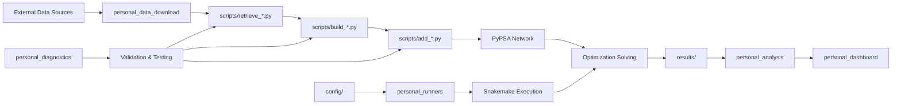
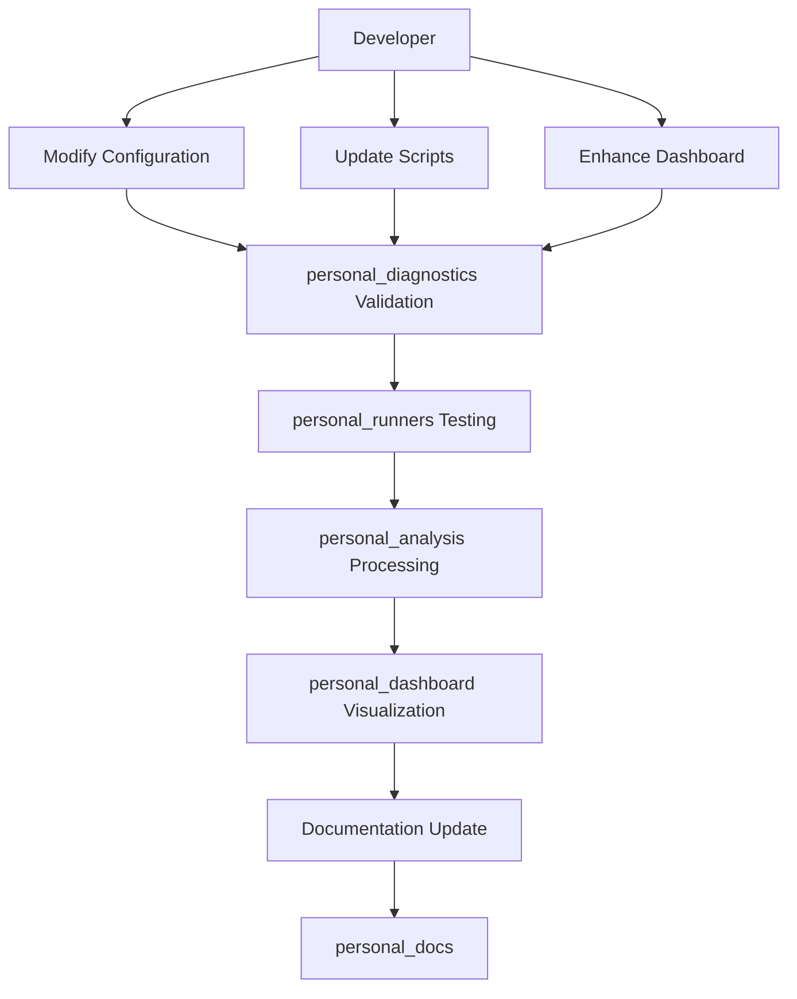

# General Documentation


---
# Source: personal_docs\README.md

==================================================================
# 📚 Documentation - Project Guides & References

Comprehensive documentation for the PyPSA-Eur Romania analysis project. Organized guides for configurations, results, and implementation details.

## Documentation Index

### Configuration & Setup

#### **PLAN.md**
Original project plan outlining the winter 2023 stress scenario implementation.

**Contents:**
- Baseline & stress scenario definitions
- Geographic scope (Romania + neighboring countries)
- Temporal window (January 13-20, 2023)
- Shock definitions and implementation strategy
- Hybrid operations mode specifications
- SCADA proxy constraints (ramp rates)

**Use When:** Understanding original project objectives and constraints

---

### Dashboard Documentation

#### **DASHBOARD_README.md**
User guide for v1 dashboard - baseline vs. stress scenario visualization (2023).

**Contents:**
- Installation instructions
- UI walkthrough (all 6 taburi)
- Data interpretation guide
- Troubleshooting

**Tabs Covered:**
1. Rezumat (Summary) - Overall metrics
2. Costuri (Costs) - Cost breakdown
3. Generare (Generation) - Generation mix
4. Congestie (Congestion) - Line loading
5. Preț (Price) - Marginal prices
6. Date Brute (Raw Data) - CSV viewer

**Status:** ✅ WORKING - v1 dashboard

---

#### **VISUALIZER_COMPARISON.md**
Comparison document highlighting differences between v1 and v2 dashboard implementations.

**Covers:**
```
v1 (Fixed)                     v2 (Current)
├─ Fixed scenarios            ├─ Dynamic scenario selection
├─ Single format             ├─ Dual-format support
├─ Baseline vs. Stress       ├─ Any scenario support
├─ 6 taburi                  ├─ 6 taburi (format-aware)
└─ Known issue: column names └─ Auto column detection
```

**Key Changes:**
- Column name flexibility
- NEW format vs LEGACY format handling
- Format-specific rendering paths
- Automatic scenario discovery

---

#### **DASHBOARD_V2_IMPLEMENTATION.md**
Technical implementation guide for v2 dashboard.

**Contents:**
- Architecture overview
- Format detection algorithm
- Data extraction methods
- Tab-by-tab implementation details
- Testing checklist

**Format Support:**
```
NEW Format (Report):
  ✅ system_cost_comparison.csv → comparative analysis
  ✅ generation_mix_mwh.csv → generation graphics
  ✅ lmp_summary_ro.csv → price comparison

LEGACY Format (Native):
  ✅ costs.csv → cost aggregation
  ✅ energy.csv → generation extraction
  ✅ prices.csv → price statistics
  ✅ capacity_factors.csv → CF extraction
```

---

#### **FORMAT_SUPPORT.md**
Detailed specification of data format support in dashboards.

**Contents:**
```
Two Output Formats:

1. NEW Format (Report Pipeline)
   Source: scripts/report_romania_winter_stress.py
   Files: 7 CSVs with standardized schema
   Use Case: Baseline vs. stress comparison

2. LEGACY Format (Native PyPSA)
   Source: Direct network export
   Files: 14+ CSVs with raw results
   Use Case: Single scenario analysis

Format Detection:
  NEW = Presence of system_cost_comparison.csv
  LEGACY = Presence of costs.csv AND energy.csv
```

**Data Mapping:** Shows how legacy data maps to display metrics

---

### Configuration Guides

#### **romania_config_explanation.md**
Detailed explanation of Romania scenario configuration (English).

**Covers:**
- General run settings (name, disable-progressbar)
- Scenario & scope (countries, years, snapshots)
- Network options (bus selection, resolution)
- Solver parameters
- Technology constraints

**File Reference:** `config/romania.yaml`

**For:** Understanding and modifying base configuration

---

#### **romania_complex_explanation.md**
(Virtual Reference - Documentation only)
The Maximum Complexity Simulation (`romania_2023_complex.yaml`) enables **all** conventional and renewable carriers simultaneously to model the grid at maximum fidelity.

**Key Features:**
- **Carriers Enabled:** Solar (incl. tracking), Wind (On/Off/Float), Hydro (RoR/Reservoir), Nuclear, Coal, Lignite, Biomass, Geothermal, OCGT, CCGT, Oil.
- **Extendable:** All generation carriers are marked as extendable, allowing the solver to optimize capacity for any of them.
- **No Exclusion:** `clustering.exclude_carriers` is completely emptied, meaning no technologies are artificially removed before solving.
- **Filter adjustment:** The `powerplants_filter` does not exclude nuclear or coal.

**For:** Advanced system modeling involving the entire spectrum of Romanian energy resources.

---

#### **romania_config_explanation_ro.md**
Same as above but in Romanian (🇷🇴).

**Purpose:** Support Romanian-speaking users in configuration management

**File Reference:** `config/romania.yaml`

---

### Results & Analysis

#### **results_summary.md**
Example output showing typical simulation results.

**Contains:**
- System overview (buses, generators, lines)
- Installed capacities by carrier (GW)
- Annual generation (TWh)
- Cost breakdown
- Marginal price statistics

**Generated By:** `analysis/summarize_results.py`

**Use When:** Understanding result format and magnitude

---

#### **scenario_11_failure_log.md**
Failure analysis for Scenario 11 (Sibiu Regional Crisis).

**Documents:**
```
Simulation Attempted:
  Scenario 11: Sibiu Regional Crisis
  Config: romania_adversarial_11_sibiu_regional_crisis.yaml

Error Encountered:
  "ValueError: Solver scip does not support quadratic problems"

Root Cause:
  Clustering algorithm uses quadratic optimization
  SCIP solver lacks quadratic support

Solutions Proposed:
  1. Switch to Gurobi solver
  2. Modify clustering algorithm
  3. Reduce spatial resolution
```

**Lessons:** Not all adversarial scenarios succeed; solver/algorithm compatibility matters

---

#### Additional Documentation Files (in this folder)

files moved from root:
- **README2.md** - Supplement to main README  
- **README3.md** - Project documentation extension (Romanian)

---

## Documentation Organization

```
docs/
├── PLAN.md                              (Project Plan)
├── DASHBOARD_README.md                  (v1 Guide)
├── VISUALIZER_COMPARISON.md             (v1 vs v2)
├── DASHBOARD_V2_IMPLEMENTATION.md       (v2 Technical)
├── FORMAT_SUPPORT.md                    (Data Formats)
├── romania_config_explanation.md        (Config Guide - EN)
├── romania_config_explanation_ro.md     (Config Guide - RO)
├── results_summary.md                   (Example Results)
├── scenario_11_failure_log.md           (Failure Analysis)
├── README2.md                           (Supplementary)
├── README3.md                           (Romanian Guide)
└── README.md                            (This file)
```

---

## Quick Navigation by Topic

### 📊 Dashboard & Visualization
- **Getting Started:** DASHBOARD_README.md
- **Version Differences:** VISUALIZER_COMPARISON.md
- **Implementation Details:** DASHBOARD_V2_IMPLEMENTATION.md
- **Supported Formats:** FORMAT_SUPPORT.md

### ⚙️ Configuration & Setup
- **Core Configuration:** romania_config_explanation.md
- **Project Plan:** PLAN.md
- **Romanian Guide:** romania_config_explanation_ro.md

### 📈 Results & Analysis
- **Example Results:** results_summary.md
- **Failure Cases:** scenario_11_failure_log.md

### 🚀 Getting Started
```
1. Read: PLAN.md (understand project)
2. Read: FORMAT_SUPPORT.md (understand data)
3. Read: DASHBOARD_README.md (understand UI)
4. Configure: romania_config_explanation.md
5. Run: See ../runners/README.md
6. Visualize: See ../dashboard/README.md
```

---

## How to Use This Documentation

**For New Users:**
1. Start with PLAN.md (understand project scope)
2. Read DASHBOARD_README.md (understand outputs)
3. Follow setup instructions in ../runners/README.md

**For Configuration Changes:**
1. Reference romania_config_explanation.md
2. Edit config/*.yaml files
3. Verify with ../diagnostics/check_romania.py

**For Troubleshooting:**
1. Check scenario_11_failure_log.md for known issues
2. See ../diagnostics/README.md for diagnostic tools
3. Reference FORMAT_SUPPORT.md if data issues occur

**For Understanding Results:**
1. View example results in results_summary.md
2. Load actual results with ../dashboard/visualize_scenarios_ui_v2.py
3. Run analysis scripts from ../analysis/README.md

---

## File References

All documentation cross-references files using relative paths:
```
../dashboard/      → Dashboard applications
../runners/        → Scenario execution scripts
../analysis/       → Result processing tools
../diagnostics/    → Validation tools
../data_download/  → Data acquisition
config/            → Configuration files (root)
results/           → Scenario outputs (root)
```

---

## Language Support

**English Documentation:**
- DASHBOARD_README.md
- VISUALIZER_COMPARISON.md
- DASHBOARD_V2_IMPLEMENTATION.md
- FORMAT_SUPPORT.md
- romania_config_explanation.md
- PLAN.md
- results_summary.md
- scenario_11_failure_log.md

**Romanian Documentation:**
- romania_config_explanation_ro.md
- README3.md (partial)

---

## Document Maintenance

**Last Updated:** April 2026

**Maintained By:** PyPSA-Eur Romania Analysis Team

**To Update:** Edit corresponding .md files and commit changes

---

## Related Folders

| Folder | Purpose | Docs |
|--------|---------|------|
| [../dashboard/](../dashboard/) | UI visualization | DASHBOARD_README.md |
| [../runners/](../runners/) | Scenario execution | PLAN.md, romania_config_explanation.md |
| [../analysis/](../analysis/) | Results analysis | results_summary.md, scenario_11_failure_log.md |
| [../diagnostics/](../diagnostics/) | Data validation | FORMAT_SUPPORT.md |

---

## Quick Links

- **Main Dashboard:** `../dashboard/visualize_scenarios_ui_v2.py`
- **Run Scenarios:** `../runners/run_all_scenarios.py`
- **Analyze Results:** `../analysis/explore_scenarios.py`
- **Validate Data:** `../diagnostics/check_csv.py`

---

## Support

For questions or issues:
1. Check relevant documentation in this folder
2. Review ../diagnostics/README.md for validation tools
3. Consult ../analysis/analyze_scenario_11.py for failure analysis
4. See ../dashboard/README.md for UI troubleshooting


---
# Source: personal_docs\README2.md

==================================================================
# PyPSA-Eur Romania Analysis - Project Documentation

This document describes the custom workflow developed for running PyPSA-Eur energy system simulations focused on **Romania**. It covers dataset downloading, scenario configuration, simulation execution, and results analysis.

---

## 📁 Project Structure

```
pypsa-eur/
├── config/
│   ├── romania.yaml                 # Base Romania config (2013 tutorial)
│   ├── romania_2023_winter.yaml     # Winter 2023 scenario
│   ├── romania_2023_spring.yaml     # Spring 2023 scenario
│   ├── romania_2023_summer.yaml     # Summer 2023 scenario
│   ├── romania_2023_autumn.yaml     # Autumn 2023 scenario
│   ├── romania_2023_december.yaml   # December 2023 scenario
│   └── plotting.default.yaml        # Plotting configuration
├── results/
│   ├── romania-test/                # Initial tutorial test run
│   ├── romania-2023-winter/         # Winter scenario results
│   ├── romania-2023-spring/         # Spring scenario results
│   ├── romania-2023-summer/         # Summer scenario results
│   ├── romania-2023-autumn/         # Autumn scenario results
│   └── romania-2023-december/       # December scenario results
├── download_zenodo_files.py         # Download all required datasets
├── download_cutout.py               # Download weather cutouts only
├── generate_configs.py              # Generate seasonal config files
├── run_all_scenarios.py             # Run all seasonal scenarios
├── run_remaining_scenarios.py       # Run specific remaining scenarios
├── run_summary.py                   # Generate CSVs and plots
├── check_romania.py                 # Validate simulation results
├── interpret_results.py             # Analyze December results
├── summarize_results.py             # Summarize tutorial results
├── check_csv.py                     # Validate CSV outputs
└── check_url.py                     # Test Zenodo URL availability
```

---

## 🔧 Prerequisites

- **Conda environment**: `pypsa` with PyPSA-Eur installed
- **Solver**: HiGHS (open-source LP solver)
- **Python packages**: `pypsa`, `pandas`, `matplotlib`, `pyyaml`, `requests`

---

## 📥 Step 1: Download Required Datasets

PyPSA-Eur requires several large datasets from Zenodo that may fail during automatic download (503/504 errors). Use the custom download scripts as a workaround.

### 1.1 Download All Datasets (Recommended)

```bash
python download_zenodo_files.py
```

**Downloads:**
| File | Destination | Size |
|------|-------------|------|
| `europe-2013-sarah3-era5.nc` | `data/cutout/archive/v0.8/` | ~8 GB |
| `europe-2020-sarah3-era5.nc` | `data/cutout/archive/v0.8/` | ~8 GB |
| `LUISA_basemap_020321_50m.tif` | `data/luisa_land_cover/archive/2021-03-02/` | ~1 GB |
| `shipdensity_global.zip` | `data/ship_raster/archive/v5/` | ~500 MB |

### 1.2 Download Weather Cutouts Only

```bash
python download_cutout.py
```

Downloads only the ERA5/SARAH3 weather cutouts for 2013, 2020, and 2023.

### 1.3 Check URL Availability

```bash
python check_url.py
```

Tests if Zenodo URLs are accessible before downloading.

---

## ⚙️ Step 2: Configuration

### 2.1 Base Configuration: `config/romania.yaml`

The base configuration for Romania includes:

| Parameter | Value | Description |
|-----------|-------|-------------|
| Country | `RO` | Romania only |
| Clusters | `5` | Network clustered to 5 nodes |
| Time Period | 2013-03-01 to 2013-03-08 | 1 week snapshot |
| Resolution | `24h` | Daily time steps |
| Solver | `highs` | Open-source HiGHS solver |
| CO2 Limit | 100 Mt | Loose constraint for testing |

**Extendable carriers:**
- Generators: Solar, Onshore Wind, Offshore Wind (AC), Gas (OCGT, CCGT), Nuclear
- Storage: Battery, H2 stores
- Links: H2 pipeline

### 2.2 Generate Seasonal Configurations

```bash
python generate_configs.py
```

Creates 5 seasonal configuration files for year 2023:

| Config File | Period | Run Name |
|-------------|--------|----------|
| `romania_2023_winter.yaml` | Jan 1-8, 2023 | romania-2023-winter |
| `romania_2023_spring.yaml` | Apr 1-8, 2023 | romania-2023-spring |
| `romania_2023_summer.yaml` | Jul 1-8, 2023 | romania-2023-summer |
| `romania_2023_autumn.yaml` | Oct 1-8, 2023 | romania-2023-autumn |
| `romania_2023_december.yaml` | Dec 1-8, 2023 | romania-2023-december |

All 2023 scenarios use the `europe-2023-sarah3-era5` weather cutout.

---

## 🚀 Step 3: Run Simulations

### 3.1 Run Single Scenario

```bash
# Unlock the directory (if needed)
conda run -n pypsa snakemake --unlock --configfile config/romania_2020_december.yaml

# Run the simulation
conda run -n pypsa snakemake -call results/romania-2023-december/networks/base_s_5_elec_.nc --configfile config/romania_2023_december.yaml
```

### 3.2 Run All Seasonal Scenarios

```bash
python run_all_scenarios.py
```

Automatically runs all `romania_2020_*.yaml` configurations in sequence.

### 3.3 Run Specific Remaining Scenarios

```bash
python run_remaining_scenarios.py
```

Runs only winter, spring, and summer scenarios (useful if some scenarios already completed).

---

## 📊 Step 4: Analyze Results

### 4.1 Validate Simulation Output

```bash
python check_romania.py
```

Checks if the network file exists and displays:
- Network statistics (buses, lines, generators, loads)
- Capacity by carrier (MW)
- Transmission expansion

### 4.2 Generate Summary CSVs and Plots

```bash
python run_summary.py
```

For each scenario, generates:

**CSV files** (in `results/{scenario}/csvs/`):
- `costs.csv` - System costs breakdown
- `energy.csv` - Energy generation by carrier
- `energy_balance.csv` - Energy balance

**Plot files** (in `results/{scenario}/graphs/`):
- `costs.png` - Cost bar chart
- `energy.png` - Energy bar chart
- `balances-energy.svg` - Energy balance diagram

### 4.3 Interpret December Results

```bash
python interpret_results.py
```

Outputs:
- Network statistics
- Total objective cost (EUR)
- Generation capacities by carrier (GW)
- Network visualization plot (`network_plot.png`)

### 4.4 Summarize Tutorial Results

```bash
python summarize_results.py
```

Prints a markdown-formatted summary of the `romania-test` run including:
- Total system cost
- Installed capacities (GW)
- Annual generation (TWh)
- Average marginal prices (EUR/MWh)
- Generation share (%)

### 4.5 Check CSV Output

```bash
python check_csv.py
```

Displays the first 5 lines of the costs CSV to verify format.

---

## 📂 Results Directory Structure

Each scenario produces the following outputs:

```
results/{scenario}/
├── networks/
│   └── base_s_5_elec_.nc      # Solved network (PyPSA format)
├── csvs/
│   ├── costs.csv
│   ├── energy.csv
│   └── energy_balance.csv
└── graphs/
    ├── costs.png
    ├── energy.png
    └── balances-energy.svg
```

---

## 🐛 Troubleshooting

### Zenodo Download Errors (503/504)

If automatic downloads fail:
1. Run `python check_url.py` to verify URLs
2. Use `python download_zenodo_files.py` for retry logic
3. Or download manually from [Zenodo](https://zenodo.org/) and place in correct folders

### Snakemake Lock Issues

```bash
conda run -n pypsa snakemake --unlock --configfile config/romania.yaml
```

### Missing Network File

If `check_romania.py` fails:
1. Verify the simulation completed without errors
2. Check the target path matches: `results/{run_name}/networks/base_s_5_elec_.nc`

### Incomplete Files Exception

```bash
conda run -n pypsa snakemake --cleanup-metadata {target} --configfile {config}
```

---

## 📚 Additional Documentation

- [romania_config_explanation.md](romania_config_explanation.md) - Detailed explanation of config parameters
- [romania_config_explanation_ro.md](romania_config_explanation_ro.md) - Romanian language explanation
- [results_summary.md](results_summary.md) - Summary of all scenario results

---

## 🏃 Quick Start

```bash
# 1. Download datasets
python download_zenodo_files.py

# 2. Generate seasonal configs
python generate_configs.py

# 3. Run all scenarios
python run_all_scenarios.py

# 4. Generate summaries and plots
python run_summary.py

# 5. Check results
python check_romania.py
```

---

## 📋 Completed Runs

| Scenario | Status | Results Path |
|----------|--------|--------------|
| romania-test | ✅ Complete | `results/romania-test/` |
| romania-2023-winter | ✅ Complete | `results/romania-2023-winter/` |
| romania-2023-spring | ✅ Complete | `results/romania-2023-spring/` |
| romania-2023-summer | ✅ Complete | `results/romania-2023-summer/` |
| romania-2023-autumn | ✅ Complete | `results/romania-2023-autumn/` |
| romania-2023-december | ✅ Complete | `results/romania-2023-december/` |

---

*Last updated: April 2026*

---

## 🇷🇴 Rezultate Scenariul 11: Criza Regională Sibiu

Acest scenariu ("Sibiu Regional Crisis") a simulat o situație extremă constând în:
- **Indisponibilități majore:** Oprirea centralei nucleare Cernavodă, secetă hidrologică severă (20% capacitate), lipsă totală de gaz natural.
- **Restricții de rețea:** Capacitate de transport redusă la 30% și izolare totală față de vecini (fără importuri).
- **Cerere crescută:** Consum majorat cu 20%.

### Rezultate Principale (Săptămâna 1-7 Decembrie 2023)

În ciuda restricțiilor severe, sistemul a reușit să acopere cererea fără deconectări majore de consumatori ("load shedding"), bazându-se pe un mix energetic de urgență:

1.  **Cost Total de Operare:** 25.68 Milioane EUR
2.  **Preț Marginal Mediu:** 17.70 EUR/MWh (Max: 81.16 EUR/MWh în zona RO0 7)
3.  **Mix de Generare:**
    *   ☀️ Solar: ~31 GWh (Sursă principală pe timp de zi)
    *   🟤 Lignit: ~12.5 GWh (Bază de noapte)
    *   💨 Eolian Pe Uscat: ~12.5 GWh
    *   ⚫ Huilă: ~0.4 GWh
    *   ❌ Fără Nuclear, Hidro sau Gaz (indisponibil conform scenariului)

**Concluzie:** Sistemul energetic românesc a demonstrat reziliență în acest scenariu teoretic, reușind să mențină echilibrul prin utilizarea intensivă a capacităților pe cărbune rămase și a producției regenerabile, deși la costuri și emisii ridicate, și cu prețuri marginale locale semnificative.


---
# Source: personal_docs\README3.md

==================================================================
# PyPSA-Eur Romania - Scenariu Stres de Iarna 2020
## Documentație Proiect (README3.md)

Acest document descrie extensia PyPSA-Eur pentru simulări complexe de stres a sistemului energetic românesc. Proiectul adaugă funcționalități de analiză a scenariilor de bază vs. stres cu aplicarea de șocuri multiple.

---

## 📁 Structura Proiectului - Fișiere NOI

```
pypsa-eur/
├── config/adversarial/
│   ├── romania_2023_winter_baseline.yaml      # Config: scenariu de bază (fără șocuri)
│   ├── romania_2023_winter_stress.yaml        # Config: scenariu stres (cu toate șocurile)
│   └── [alte scenarii adversariale...]
│
├── scripts/
│   ├── romania_winter_stress.py               # Modul principal de șocuri
│   ├── report_romania_winter_stress.py        # Generator de rapoarte de comparație
│   └── solve_network.py                       # (Modificat) Integrare șocuri în solver
│
├── results/
│   ├── romania-2023-winter-baseline/
│   │   └── networks/base_s_10_elec_.nc       # Rețea reolvată (bază)
│   ├── romania-2023-winter-stress/
│   │   └── networks/base_s_10_elec_.nc       # Rețea rezolvată (stres)
│   └── romania-2023-winter-stress-comparison/
│       ├── system_cost_comparison.csv         # Comparație costuri
│       ├── ens_summary.csv                    # Rezumat energie nelivrată
│       ├── generation_mix_mwh.csv             # Mix de generare
│       ├── daily_net_imports_mwh.csv          # Importuri/exporturi zilnice
│       ├── interconnector_flow_congestion.csv # Congestionare linii
│       ├── lmp_summary_ro.csv                 # Prețuri marginale
│       ├── curtailment_mwh.csv                # Curtare energie regenerabilă
│       ├── fig_01_shedding_timeseries.{png,pdf} # Grafic: deconectări
│       ├── fig_02_daily_net_imports.{png,pdf}   # Grafic: flux importuri
│       ├── fig_03_generation_mix.{png,pdf}      # Grafic: mix generare
│       ├── fig_04_interconnector_loading.{png,pdf} # Grafic: încărcare linii
│       ├── fig_05_ro_price_distribution.{png,pdf}  # Grafic: prețuri
│       └── assumptions_limitations.md         # Documentație asumpții
│
├── run_romania_winter_stress.py               # Orchestrator: rulează bază + stres
├── run_scenario_v2.bat                        # Batch script pentru Windows
├── explore_scenarios.py                       # Script explorare date
├── visualize_scenarios_ui_v2.py                  # (NOU) Dashboard interactiv România
├── README3.md                                 # Acest fișier
└── [fișiere existente...]
```

---

## 🔄 Fluxul de Lucru Complet

### 1. **Configurare Scenarii** (`config/adversarial/*.yaml`)

Două configurații paralele pentru același interval de timp (Dec 1-8, 2023):

#### `romania_2023_winter_baseline.yaml`
- **Run name:** `romania-2023-winter-baseline`
- **Țări:** RO, BG, HU, RS
- **Clustere:** 10 noduri
- **Șocuri:** NICIUN șoc aplicat
- **Utilizare:** Scenariu referință (baseline)

#### `romania_2019_winter_stress.yaml`
- **Run name:** `romania-2020-winter-stress`
- **Țări:** RO, BG, HU, RS (șocuri aplicate doar RO)
- **Clustere:** 10 noduri
- **Șocuri aplicate:**
  - Cerere: +12% pe toată perioada
  - Hidro: 60% disponibilitate
  - Gaz: 70% disponibilitate primele 72h
  - SCADA: Rampă 10%/h (24h), apoi 25%/h (48h)
  - Import cap: 0% (48h), 50% (48h), fără limită (72h)

---

## 🔧 Module Principale

### 2. **Modul Șocuri** (`scripts/romania_winter_stress.py`)

Implementează 3 funcții de bază:

#### `apply_timeseries_shocks(n, snapshots, cfg)`
Aplică șocuri pre-optimizare:
```python
# Incrementează cererea
n.loads_t.p_set *= 1.12

# Reduce disponibilitate hidro
ro_hydro_gens = n.generators[(n.generators.carrier.isin(['ror', 'hydro'])) & 
                              (n.generators.bus.str.contains('RO'))]
ro_hydro_gens.p_max_pu *= 0.60

# Reduce disponibilitate gaz (primele 72 ore)
ga_gens = n.generators[n.generators.carrier.isin(['OCGT', 'CCGT'])]
ga_gens.p_max_pu.iloc[:, :72] *= 0.70
```

#### `add_scada_proxy_constraints(n, snapshots, cfg)`
Adaugă constrângeri de rampă pentru generatoare RO:
- **Ore 1-24:** Rampă ≤ 10% din p_nom/oră
- **Ore 25-72:** Rampă ≤ 25% din p_nom/oră

#### `add_import_cap_constraints(n, snapshots, cfg)`
Limitează importurile la granița RO:
- **Ore 1-48:** Capacitate = 0%
- **Ore 49-96:** Capacitate = 50%
- **Ore 97+:** Fără limită suplimentară

---

### 3. **Generator Rapoarte** (`scripts/report_romania_winter_stress.py`)

Ejecutat post-optimizare. Argumentele CLI:
```bash
python scripts/report_romania_winter_stress.py \
  --baseline-net <cale_bază> \
  --scenario-net <cale_stres> \
  --country RO \
  --outdir <director_ieșire>
```

**Outputs:**
- 7 CSV-uri cu metrici detaliate
- 5 perechi PNG/PDF (figuri)
- 1 document markdown cu asumpții

---

### 4. **Integrare Solver** (`scripts/solve_network.py` - MODIFICAT)

Punerea în aplicare:

**În `prepare_network()`:**
```python
stress_cfg = config.get("stress_test", {})
if stress_cfg.get("enable"):
    apply_timeseries_shocks(n, n.snapshots, stress_cfg)
```

**În `extra_functionality()`:**
```python
if stress_cfg.get("enable"):
    add_scada_proxy_constraints(n, snapshots, stress_cfg)
    add_import_cap_constraints(n, snapshots, stress_cfg)
```

---

## 🚀 Cum să Rulez Simulările

### Pasul 1: Rulare Automată (Recomandată)

```bash
python run_romania_winter_stress.py
```

Aceasta:
1. Deblochează și rezolvă scenariu de bază
2. Deblochează și rezolvă scenariu stres
3. Generează raport de comparație
4. Afișează căi fișiere output

### Pasul 2: Rulare Manuală (Pass-by-Pass)

```bash
# Bază
snakemake --unlock --configfile config/adversarial/romania_2019_winter_baseline.yaml
snakemake solve_elec_networks --configfile config/adversarial/romania_2019_winter_baseline.yaml -c all

# Stres
snakemake --unlock --configfile config/adversarial/romania_2019_winter_stress.yaml
snakemake solve_elec_networks --configfile config/adversarial/romania_2019_winter_stress.yaml -c all

# Raport
python scripts/report_romania_winter_stress.py \
  --baseline-net results/romania-2019-winter-baseline/networks/base_s_10_elec_.nc \
  --scenario-net results/romania-2020-winter-stress/networks/base_s_10_elec_.nc \
  --country RO \
  --outdir results/romania-2020-winter-stress-comparison
```

---

## 📊 Analiză Rezultate

### Fișiere CSV Disponibile

| Fișier | Descriere |
|--------|-----------|
| `system_cost_comparison.csv` | Cost total bază vs. stres (EUR) |
| `ens_summary.csv` | Energie nelivrată, ore deconectare, max MW |
| `generation_mix_mwh.csv` | MWh generat pe tehnologie/caz |
| `daily_net_imports_mwh.csv` | Flux zilnic de importuri/exporturi |
| `interconnector_flow_congestion.csv` | Încărcare linii (%, congestionare) |
| `lmp_summary_ro.csv` | Statistici preț marginal local (EUR/MWh) |
| `curtailment_mwh.csv` | Energie regenerabilă curtată |

### Figuri Disponibile

| Figură | Descriere |
|--------|-----------|
| `fig_01_shedding_timeseries` | Serie temporală deconectări (MW) |
| `fig_02_daily_net_imports` | Importuri/exporturi zilnice (MWh) |
| `fig_03_generation_mix` | Comparație mix generare bază vs. stres |
| `fig_04_interconnector_loading` | Încărcare linii timp |
| `fig_05_ro_price_distribution` | Distribuție prețuri marginale RO |

---

## 🎨 Dashboard Interactiv (`visualize_scenarios_ui_v2.py`)

Program Python complex de vizualizare în limba română:

```bash
python visualize_scenarios_ui_v2.py
```

**Caracteristici:**
- ✅ Interfață taburi: Rezumat, Costuri, Generare, Congestie, Preț
- ✅ Grafice live cu matplotlib
- ✅ Tabele de date interactive
- ✅ Statistici comparative
- ✅ Toate textele în română
- ✅ Export date la CSV

---

## 📈 Rezultate Cheie (Exemplu)

| Metrica | Bază | Stres | Schimbare |
|---------|------|-------|-----------|
| **Cost Total** | €14.94B | €34.15B | +128.6% |
| **ENS (MWh)** | 0 | 26,413 | Crisis! |
| **Max Deconectare** | 0 MW | 2,783 MW | - |
| **Hidro** | 141,876 MWh | 85,125 MWh | -40% |
| **Încope Max Linie** | 28.5% | 32.0% | +3.5pp |

---

## 🔗 Fluxul de Date

```
Config YAML (bază + stres)
        ↓
Snakemake → PyPSA Network Build
        ↓
apply_timeseries_shocks() [Doar stres]
        ↓
Solver HiGHS (Optimizare)
        ↓
add_scada_proxy_constraints() [Doar stres]
add_import_cap_constraints() [Doar stres]
        ↓
Network Solved (.nc file)
        ↓
report_romania_winter_stress.py
        ↓
CSV + Figures + Markdown
        ↓
visualize_scenarios_ui_v2.py [Dashboard]
```

---

## 🛠️ Troubleshooting

### Problema: "MissingInputException: data/cutout/archive/.../europe-2019-era5.nc"
**Soluție:** Configs folosesc 2020, nu 2019. Fișier deja scarcat.

### Problema: "RuleException: build_hydro_profile"
**Soluție:** Interval de timp în snapshot necorespunde cutout. Folosiți 2020-12-01 la 2020-12-08.

### Problema: "No module named 'snakemake'"
**Soluție:** 
```bash
conda activate pypsa-eur
```

### Problema: Dashboard nu se deschide
**Soluție:** Verificați ca fișierele CSV/PNG existe în `results/romania-2020-winter-stress-comparison/`

---

## 📚 Fișiere de Referință

- [PLAN.md](PLAN.md) - Plan detaliat tehnic
- [romania_config_explanation.md](romania_config_explanation.md) - Parametri config
- [README2.md](README2.md) - Workflow scenarii sezonale
- [assumptions_limitations.md](results/romania-2020-winter-stress-comparison/assumptions_limitations.md) - Asumpții stres

---

## ✅ Checklist Rulare

- [ ] Configurații YAML create
- [ ] Module Python create (romania_winter_stress.py, report_*.py)
- [ ] solve_network.py modificat
- [ ] `python run_romania_winter_stress.py` executat cu succes
- [ ] Fișiere output în `results/romania-2020-winter-stress-comparison/`
- [ ] Dashboard `visualize_scenarios_ui_v2.py` funcțional

---

*Actualizat: 18 februarie 2026*


---
# Source: data\entsoegridkit\README.md

==================================================================
# Unofficial ENTSO-E dataset processed by GridKit

This dataset was generated based on a map extract from March 2022.
This is an _unofficial_ extract of the
[ENTSO-E interactive map](https://www.entsoe.eu/data/map/)
of the European power system (including to a limited extent North
Africa and the Middle East). The dataset has been processed by GridKit
to form complete topological connections.  This dataset is neither
approved nor endorsed by ENTSO-E.

This dataset may be inaccurate in several ways, notably:

+ Geographical coordinates are transfered from the ENTSO-E map, which
  is known to choose topological clarity over geographical
  accuracy. Hence coordinates will not correspond exactly to reality.
+ Voltage levels are typically provided as ranges by ENTSO-E, of which
  the lower bound has been reported in this dataset.
+ Line structure conflicts are resolved by picking the first structure
  in the set
+ Transformers are _not present_ in the original ENTSO-E dataset,
  their presence has been derived from the different voltages from
  connected lines.
+ The connection between generators and busses is derived as the
  geographically nearest station at the lowest voltage level. This
  information is again not present in the ENTSO-E dataset.

All users are advised to exercise caution in the use of this
dataset. No liability is taken for inaccuracies.


## Contents of dataset

This dataset is provided as set of CSV files that describe the ENTSO-E
network. These files use the comma (`,`) as field separator, single
newlines (`\n`) as record separator, and single quotes (`'`) as string
quote characters. The CSV files have headers.

Example code for reading the files:

    # R
    buses <- read.csv("buses.csv", header=TRUE, quote="'")
    # python
    import io, csv
    class dialect(csv.excel):
        quotechar = "'"
    with io.open('buses.csv', 'rb') as handle:
        buses = list(csv.DictReader(handle, dialect))

### buses.csv:

Describes terminals, vertices, or 'nodes' of the system

+ `bus_id`: the unique identifier for the bus
+ `station_id`: unique identifier of its substation; a station may have multiple buses, which are typically connected by transformers
+ `voltage`: the operating voltage of this bus
+ `dc`: boolean ('t' or 'f'), describes whether the bus is a HVDC
  terminal (t) or a regular AC terminal (f)
+ `symbol`: type of station of this bus.
+ `under_construction`: boolean ('t' if station is currently under construction,
  'f' otherwise)
+ `tags`: _hstore_ encoded dictionary of 'extra' properties for this bus
+ `x`: longitude of its location
+ `y`: latitude of its location

**NOTA BENE**: During the processing of the network, so called
'synthetic' stations may be inserted on locations where lines are
apparantly connected. Such synthetic stations can be recognised
because their symbol is always `joint`.

### lines.csv:

Buses are connected by AC-lines:

+ `line_id`: unique identifier for the line
+ `bus0`: first of the two connected buses
+ `bus1`: second of two connected buses
+ `voltage`: operating voltage of the line (identical to operating voltage of
  the bus)
+ `circuits`: number of (independent) circuits in this link, each of which
  typically has 3 cables.
+ `length`: length of line in km
+ `underground`: boolean, `t` if this is an underground cable, `f` for
  an overhead line
+ `under_construction`: boolean, `t` for lines that are currently
  under construction
+ `tags`: _hstore_ encoded dictionary of extra properties for this link
+ `geometry`: extent of this line in well-known-text format (WGS84)

### links.csv:

Connections between buses:

+ `link_id`: unique identifier for the link
+ `bus0`: first of the two connected buses
+ `bus1`: second of two connected buses
+ `length`: length of line in km
+ `under_construction`: boolean, `t` for lines that are currently
  under construction
+ `tags`: _hstore_ encoded dictionary of extra properties for this link
+ `geometry`: extent of this line in well-known-text format (WGS84)

### generators.csv

Generators attached to the network.

+ `generator_id`: unique identifier for the generator
+ `bus_id`: the bus to which this generator is connected
+ `technology`: type of generator
+ `capacity`: capacity of this generator in MW
+ `tags`: _hstore_ encoded dictionary of extra attributes
+ `geometry`: location of generator in well-known text format (WGS84)

### transformers.csv

A transformer connects buses which operate at distinct voltages. **NOTA BENE**:
Transformers are _not_ represented in the original dataset, but instead have
been added at substations to connect AC transmission lines of distinct voltage
levels.

+ `transformer_id`: unique identifier
+ `bus0`: Bus at lower voltage level
  `bus1`: Bus at higher voltage level

### converters.csv

Back-to-back converters connecting non-synchronized buses.

+ `converter_id`: unique identifier
+ `bus0`: First bus
  `bus1`: Second bus


---
# Source: vault\Core\README.md

==================================================================
<!--
SPDX-FileCopyrightText: Contributors to PyPSA-Eur <https://github.com/pypsa/pypsa-eur>
SPDX-License-Identifier: CC-BY-4.0
-->


[](https://github.com/pypsa/pypsa-eur/actions/workflows/test.yaml)
[](https://pypsa-eur.readthedocs.io/en/latest/?badge=latest)

[](https://doi.org/10.5281/zenodo.3520874)
[](https://doi.org/10.5281/zenodo.3938042)
[](https://snakemake.readthedocs.io)
[](https://discord.gg/AnuJBk23FU)
[](https://api.reuse.software/info/github.com/pypsa/pypsa-eur)

# PyPSA-Eur: A Sector-Coupled Open Optimisation Model of the European Energy System

PyPSA-Eur is an open model dataset of the European energy system at the
transmission network level that covers the full ENTSO-E area. The model is suitable both for operational studies and generation and transmission expansion planning studies.
The continental scope and highly resolved spatial scale enables a proper description of the long-range
smoothing effects for renewable power generation and their varying resource availability.


The model is described in the [documentation](https://pypsa-eur.readthedocs.io)
and in the paper
[PyPSA-Eur: An Open Optimisation Model of the European Transmission
System](https://arxiv.org/abs/1806.01613), 2018,
[arXiv:1806.01613](https://arxiv.org/abs/1806.01613).
The model building routines are defined through a snakemake workflow.
Please see the [documentation](https://pypsa-eur.readthedocs.io/)
for installation instructions and other useful information about the snakemake workflow.
The model is designed to be imported into the open toolbox
[PyPSA](https://github.com/PyPSA/PyPSA).

> [!NOTE]
> PyPSA-Eur has many contributors, with the maintenance currently led by the [Department of Digital Transformation in
> Energy Systems](https://tu.berlin/en/ensys) at the [Technical University of
> Berlin](https://www.tu.berlin).
> Previous versions were developed at the [Karlsruhe
> Institute of Technology](http://www.kit.edu/english/index.php) funded by the
> [Helmholtz Association](https://www.helmholtz.de/en/).

> [!WARNING]
> PyPSA-Eur is under active development and has several
> [limitations](https://pypsa-eur.readthedocs.io/en/latest/limitations.html) which
> you should understand before using the model. The github repository
> [issues](https://github.com/PyPSA/pypsa-eur/issues) collect known topics we are
> working on (please feel free to help or make suggestions). The
> [documentation](https://pypsa-eur.readthedocs.io/) remains somewhat patchy. You
> can find showcases of the model's capabilities in the Joule paper [The potential
> role of a hydrogen network in
> Europe](https://doi.org/10.1016/j.joule.2023.06.016), another [paper in Joule
> with a description of the industry
> sector](https://doi.org/10.1016/j.joule.2022.04.016), or in [a 2021 presentation
> at EMP-E](https://nworbmot.org/energy/brown-empe.pdf). We do not recommend to
> use the full resolution network model for simulations. At high granularity the
> assignment of loads and generators to the nearest network node may not be a
> correct assumption, depending on the topology of the underlying distribution
> grid, and local grid bottlenecks may cause unrealistic load-shedding or
> generator curtailment. We recommend to cluster the network to a couple of
> hundred nodes to remove these local inconsistencies. See the discussion in
> Section 3.4 "Model validation" of the paper.


The dataset consists of:

- A grid model based on a modified [GridKit](https://github.com/bdw/GridKit)
  extraction of the [ENTSO-E Transmission System
  Map](https://www.entsoe.eu/data/map/). The grid model contains 7072 lines
  (alternating current lines at and above 220kV voltage level and all high
  voltage direct current lines) and 3803 substations.
- The open power plant database
  [powerplantmatching](https://github.com/PyPSA/powerplantmatching).
- Electrical demand time series from the
  [OPSD project](https://open-power-system-data.org/).
- Renewable time series based on ERA5 and SARAH, assembled using the [atlite tool](https://github.com/PyPSA/atlite).
- Geographical potentials for wind and solar generators based on land use (CORINE) and excluding nature reserves (Natura2000) are computed with the [atlite library](https://github.com/PyPSA/atlite).

A sector-coupled extension adds demand
and supply for the following sectors: transport, space and water
heating, biomass, industry and industrial feedstocks, agriculture,
forestry and fishing. This completes the energy system and includes
all greenhouse gas emitters except waste management and land use.

This diagram gives an overview of the sectors and the links between
them:


Each of these sectors is built up on the transmission network nodes
from [PyPSA-Eur](https://github.com/PyPSA/pypsa-eur):


For computational reasons the model is usually clustered down
to 50-200 nodes.

Already-built versions of the model can be found in the accompanying [Zenodo
repository](https://doi.org/10.5281/zenodo.3601881).

# Contributing and Support
We strongly welcome anyone interested in contributing to this project. If you have any ideas, suggestions or encounter problems, feel invited to file issues or make pull requests on GitHub.
-   To **discuss** with other PyPSA users, organise projects, share news, and get in touch with the community you can use the [Discord server](https://discord.gg/AnuJBk23FU).
-   For **bugs and feature requests**, please use the [PyPSA-Eur Github Issues page](https://github.com/PyPSA/pypsa-eur/issues).

# Licence

The code in PyPSA-Eur is released as free software under the
[MIT License](https://opensource.org/licenses/MIT), see [`doc/licenses.rst`](doc/licenses.rst).
However, different licenses and terms of use may apply to the various
input data, see [`doc/data_sources.rst`](doc/data_sources.rst).


---
# Source: vault\Piele-Data\README.md

==================================================================
# 📥 Data Download - External Data Acquisition

Utilities for downloading required datasets from external sources. PyPSA-Eur needs environmental and geographic data for simulations.

## Data Download Scripts

### **download_cutout.py**
Downloads atmospheric/weather data cutouts for renewable energy profiles.

**Purpose:**
- Fetch ERA5 reanalysis data
- Download SARAH solar radiation data
- Extract cutouts for simulation region

**Data Downloaded:**
```
Cutout: europe-2020-sarah3-era5.nc
├── Solar irradiance (SARAH-3)
├── Wind speed (ERA5)
├── Temperature (ERA5)
├── Runoff/precipitation (ERA5)
└── Other meteorological variables
```

**Data Source:** 
- ERA5: Copernicus Climate Data Store
- SARAH-3: Satellite-based radiation data

**How to Run:**
```bash
python download_cutout.py
```

**Output:**
```
data/cutout/
├── archive/
│   └── v0.8/europe-2020-sarah3-era5.nc     (1.2 GB)
└── europe-2020-sarah3-era5.nc (symlink)
```

**Time Required:** 10-30 minutes (internet dependent)

**Storage:** ~1.2 GB (compressed netCDF format)

---

### **download_zenodo_files.py**
Downloads pre-processed datasets and benchmarks from Zenodo repository.

**Purpose:**
- Fetch power plant datasets
- Download preprocessed transmission networks
- Get cost data and technology specifications
- Retrieve benchmark configurations

**Data Downloaded:**
```
Power Plant Data
├── powerplants.csv          (Generator locations/capacities)
└── refineries.csv           (Industrial facility data)

Network Data
├── transmission_projects/   (Future expansion plans)
├── osm_boundaries/          (Geographic boundaries)
└── natura_sites/            (Environmental protections)

Cost Data
├── costs_2050.csv           (Technology cost projections)
└── parameter_corrections/   (Regional adjustments)

Benchmark Data
├── tutorial_configs/        (Example scenarios)
└── validation_datasets/     (Validation data)
```

**Data Source:** Zenodo.org (PyPSA-Eur community repository)

**How to Run:**
```bash
python download_zenodo_files.py
```

**Output:**
```
data/
├── powerplants/
│   └── primary/0.7.1/powerplants.csv
├── costs/
│   └── primary/v0.13.3/costs_2050.csv
├── entsoegridkit/
├── osm_boundaries/
└── ... (other datasets)
```

**Time Required:** 30 minutes - 2 hours (varies by dataset size and internet)

**Storage:** ~5-10 GB total for all datasets

---

## Data Organization

After successful download, data is organized as:

```
data/
├── corine/                    # Land cover data
├── costs/                     # Technology costs
│   └── primary/v0.13.3/costs_2050.csv
├── cutout/                    # Weather/atmospheric data
│   └── europe-2020-sarah3-era5.nc (1.2GB)
├── entsoegridkit/            # European grid data (ENTSOE)
├── eez/                      # Exclusive economic zones
├── eu_nuts2021/              # Regional boundaries
├── existing_infrastructure/  # Current power plants
├── gdp_per_capita/           # Economic data
├── jrc_ardeco/               # Industrial data
├── luisa_land_cover/         # High-res land cover
├── natura/                   # Protected areas
├── osm/                      # OpenStreetMap data
├── osm_boundaries/           # Geographic boundaries
├── population_count/         # Population distribution
├── powerplants/              # Generator database
│   └── primary/0.7.1/powerplants.csv
├── retro/                    # Building retrofit data
├── ship_raster/              # Shipping routes
└── synthetic_electricity_demand/  # Demand profiles
```

---

## Download Workflow

**First-Time Setup:**
```
1. Download cutout (weather data)
   python download_cutout.py

2. Download Zenodo datasets
   python download_zenodo_files.py

3. Verify downloads (see ../diagnostics/check_csv.py)
   python ../diagnostics/check_csv.py

4. Ready for scenario execution
   python ../runners/run_baseline_only.bat
```

**Subsequent Runs:**
- Datasets are cached locally
- Only run if missing data error appears
- Pre-downloaded data is reused

---

## Data Requirements Summary

| Dataset | Size | Time | Required? |
|---------|------|------|-----------|
| Cutout (Weather) | 1.2 GB | 10-30 min | ✅ YES |
| Power Plants | 50 MB | <5 min | ✅ YES |
| Costs | 30 MB | <5 min | ✅ YES |
| Boundaries | 200 MB | 5-10 min | ✅ YES |
| OSM Grid | 500 MB | 10-20 min | ✅ YES |
| ENTSOE Grid | 100 MB | 5 min | ✅ YES |
| Natura/EEZ | 100 MB | 5 min | ⚠️ Optional |
| CORINE Land | 300 MB | 10-15 min | ⚠️ Optional |

**Minimum Install:** ~2.5 GB (11000 required datasets)
**Full Install:** ~10 GB (all datasets)

---

## Troubleshooting Download Issues

### Issue: Download fails due to network error
```bash
# Retry download
python download_cutout.py  # Automatic retry built-in

# Check internet connectivity
ping www.copernicus-climate.eu
```

### Issue: Out of disk space
```bash
# Check current disk usage
dir data/ | measure-object -Sum Length

# Download individually
python download_cutout.py      # Required first
python download_zenodo_files.py  # Optional later
```

### Issue: Timeout downloading large files
```bash
# Increase timeout (modify script):
# timeout = 3600  # seconds (1 hour)

# Or download manually from:
# - CDS: https://cds.climate.copernicus.eu/
# - Zenodo: https://zenodo.org/search?q=pypsa-eur
```

### Issue: Incomplete download detected
```bash
# Delete corrupted file and retry
rm data/cutout/europe-2020-sarah3-era5.nc
python download_cutout.py
```

---

## Data Caching & Reuse

Downloaded data is automatically cached in `data/` folder:
- Future scenario runs reuse existing data
- No re-downloading unless explicitly deleted
- Archive versions kept for reproducibility

**Archive locations:**
```
data/cutout/archive/v0.8/
data/costs/primary/v0.13.3/
data/powerplants/primary/0.7.1/
```

---

## Integration with Workflow

```
1. Data Download (this folder)
   download_cutout.py
   download_zenodo_files.py
          ↓
2. Diagnostics (validate)
   check_csv.py
   check_url.py
          ↓
3. Scenario Configuration
   config/*.yaml
          ↓
4. Run Simulations (runners/)
   run_baseline_only.bat
   run_all_scenarios.py
          ↓
5. Analyze Results (analysis/)
          ↓
6. Visualize (dashboard/)
   visualize_scenarios_ui_v2.py
```

---

## File Organization

```
data_download/
├── download_cutout.py              # Download weather data
└── download_zenodo_files.py        # Download general datasets
```

---

## Data Sources

**Cutout Data:**
- **CDS (Copernicus):** https://cds.climate.copernicus.eu/
- **Source:** ERA5 reanalysis + SARAH-3 satellite radiation
- **Coverage:** Europe, hourly, 2010-2020

**Zenodo Data:**
- **Repository:** https://zenodo.org/
- **Collections:** PyPSA-Eur community datasets
- **Content:** Power plants, network data, costs, boundaries

---

## Advanced Configuration

To modify data downloads, edit the scripts:

```python
# download_cutout.py
CUTOUT_NAME = "europe-2020-sarah3-era5"
CUTOUT_DIR = Path("data/cutout")
# Modify years, region, resolution here

# download_zenodo_files.py
ZENODO_RECORDS = [
    12345,  # Dataset record ID
    67890,
    # Add more record IDs
]
```

---

## Next Steps

1. **First time:** Run both scripts in sequence
   ```bash
   python download_cutout.py
   python download_zenodo_files.py
   ```

2. **Validate:** Check for completeness
   ```bash
   python ../diagnostics/check_csv.py
   ```

3. **Ready to simulate:** Proceed to runners
   ```bash
   python ../runners/run_baseline_only.bat
   ```

4. **For troubleshooting:** See diagnostics/ folder


---
# Source: vault\Piele-Docs\README.md

==================================================================
# 📚 Documentation - Project Guides & References

Comprehensive documentation for the PyPSA-Eur Romania analysis project. Organized guides for configurations, results, and implementation details.

## Documentation Index

### Configuration & Setup

#### **PLAN.md**
Original project plan outlining the winter 2020 stress scenario implementation.

**Contents:**
- Baseline & stress scenario definitions
- Geographic scope (Romania + neighboring countries)
- Temporal window (January 13-20, 2020)
- Shock definitions and implementation strategy
- Hybrid operations mode specifications
- SCADA proxy constraints (ramp rates)

**Use When:** Understanding original project objectives and constraints

---

### Dashboard Documentation

#### **DASHBOARD_README.md**
User guide for v1 dashboard - baseline vs. stress scenario visualization.

**Contents:**
- Installation instructions
- UI walkthrough (all 6 taburi)
- Data interpretation guide
- Troubleshooting

**Tabs Covered:**
1. Rezumat (Summary) - Overall metrics
2. Costuri (Costs) - Cost breakdown
3. Generare (Generation) - Generation mix
4. Congestie (Congestion) - Line loading
5. Preț (Price) - Marginal prices
6. Date Brute (Raw Data) - CSV viewer

**Status:** ✅ WORKING - v1 dashboard

---

#### **VISUALIZER_COMPARISON.md**
Comparison document highlighting differences between v1 and v2 dashboard implementations.

**Covers:**
```
v1 (Fixed)                     v2 (Current)
├─ Fixed scenarios            ├─ Dynamic scenario selection
├─ Single format             ├─ Dual-format support
├─ Baseline vs. Stress       ├─ Any scenario support
├─ 6 taburi                  ├─ 6 taburi (format-aware)
└─ Known issue: column names └─ Auto column detection
```

**Key Changes:**
- Column name flexibility
- NEW format vs LEGACY format handling
- Format-specific rendering paths
- Automatic scenario discovery

---

#### **DASHBOARD_V2_IMPLEMENTATION.md**
Technical implementation guide for v2 dashboard.

**Contents:**
- Architecture overview
- Format detection algorithm
- Data extraction methods
- Tab-by-tab implementation details
- Testing checklist

**Format Support:**
```
NEW Format (Report):
  ✅ system_cost_comparison.csv → comparative analysis
  ✅ generation_mix_mwh.csv → generation graphics
  ✅ lmp_summary_ro.csv → price comparison

LEGACY Format (Native):
  ✅ costs.csv → cost aggregation
  ✅ energy.csv → generation extraction
  ✅ prices.csv → price statistics
  ✅ capacity_factors.csv → CF extraction
```

---

#### **FORMAT_SUPPORT.md**
Detailed specification of data format support in dashboards.

**Contents:**
```
Two Output Formats:

1. NEW Format (Report Pipeline)
   Source: scripts/report_romania_winter_stress.py
   Files: 7 CSVs with standardized schema
   Use Case: Baseline vs. stress comparison

2. LEGACY Format (Native PyPSA)
   Source: Direct network export
   Files: 14+ CSVs with raw results
   Use Case: Single scenario analysis

Format Detection:
  NEW = Presence of system_cost_comparison.csv
  LEGACY = Presence of costs.csv AND energy.csv
```

**Data Mapping:** Shows how legacy data maps to display metrics

---

### Configuration Guides

#### **romania_config_explanation.md**
Detailed explanation of Romania scenario configuration (English).

**Covers:**
- General run settings (name, disable-progressbar)
- Scenario & scope (countries, years, snapshots)
- Network options (bus selection, resolution)
- Solver parameters
- Technology constraints

**File Reference:** `config/romania.yaml`

**For:** Understanding and modifying base configuration

---

#### **romania_config_explanation_ro.md**
Same as above but in Romanian (🇷🇴).

**Purpose:** Support Romanian-speaking users in configuration management

**File Reference:** `config/romania.yaml`

---

### Results & Analysis

#### **results_summary.md**
Example output showing typical simulation results.

**Contains:**
- System overview (buses, generators, lines)
- Installed capacities by carrier (GW)
- Annual generation (TWh)
- Cost breakdown
- Marginal price statistics

**Generated By:** `analysis/summarize_results.py`

**Use When:** Understanding result format and magnitude

---

#### **scenario_11_failure_log.md**
Failure analysis for Scenario 11 (Sibiu Regional Crisis).

**Documents:**
```
Simulation Attempted:
  Scenario 11: Sibiu Regional Crisis
  Config: romania_adversarial_11_sibiu_regional_crisis.yaml

Error Encountered:
  "ValueError: Solver scip does not support quadratic problems"

Root Cause:
  Clustering algorithm uses quadratic optimization
  SCIP solver lacks quadratic support

Solutions Proposed:
  1. Switch to Gurobi solver
  2. Modify clustering algorithm
  3. Reduce spatial resolution
```

**Lessons:** Not all adversarial scenarios succeed; solver/algorithm compatibility matters

---

#### Additional Documentation Files (in this folder)

files moved from root:
- **README2.md** - Supplement to main README  
- **README3.md** - Project documentation extension (Romanian)

---

## Documentation Organization

```
docs/
├── PLAN.md                              (Project Plan)
├── DASHBOARD_README.md                  (v1 Guide)
├── VISUALIZER_COMPARISON.md             (v1 vs v2)
├── DASHBOARD_V2_IMPLEMENTATION.md       (v2 Technical)
├── FORMAT_SUPPORT.md                    (Data Formats)
├── romania_config_explanation.md        (Config Guide - EN)
├── romania_config_explanation_ro.md     (Config Guide - RO)
├── results_summary.md                   (Example Results)
├── scenario_11_failure_log.md           (Failure Analysis)
├── README2.md                           (Supplementary)
├── README3.md                           (Romanian Guide)
└── README.md                            (This file)
```

---

## Quick Navigation by Topic

### 📊 Dashboard & Visualization
- **Getting Started:** DASHBOARD_README.md
- **Version Differences:** VISUALIZER_COMPARISON.md
- **Implementation Details:** DASHBOARD_V2_IMPLEMENTATION.md
- **Supported Formats:** FORMAT_SUPPORT.md

### ⚙️ Configuration & Setup
- **Core Configuration:** romania_config_explanation.md
- **Project Plan:** PLAN.md
- **Romanian Guide:** romania_config_explanation_ro.md

### 📈 Results & Analysis
- **Example Results:** results_summary.md
- **Failure Cases:** scenario_11_failure_log.md

### 🚀 Getting Started
```
1. Read: PLAN.md (understand project)
2. Read: FORMAT_SUPPORT.md (understand data)
3. Read: DASHBOARD_README.md (understand UI)
4. Configure: romania_config_explanation.md
5. Run: See ../runners/README.md
6. Visualize: See ../dashboard/README.md
```

---

## How to Use This Documentation

**For New Users:**
1. Start with PLAN.md (understand project scope)
2. Read DASHBOARD_README.md (understand outputs)
3. Follow setup instructions in ../runners/README.md

**For Configuration Changes:**
1. Reference romania_config_explanation.md
2. Edit config/*.yaml files
3. Verify with ../diagnostics/check_romania.py

**For Troubleshooting:**
1. Check scenario_11_failure_log.md for known issues
2. See ../diagnostics/README.md for diagnostic tools
3. Reference FORMAT_SUPPORT.md if data issues occur

**For Understanding Results:**
1. View example results in results_summary.md
2. Load actual results with ../dashboard/visualize_scenarios_ui_v2.py
3. Run analysis scripts from ../analysis/README.md

---

## File References

All documentation cross-references files using relative paths:
```
../dashboard/      → Dashboard applications
../runners/        → Scenario execution scripts
../analysis/       → Result processing tools
../diagnostics/    → Validation tools
../data_download/  → Data acquisition
config/            → Configuration files (root)
results/           → Scenario outputs (root)
```

---

## Language Support

**English Documentation:**
- DASHBOARD_README.md
- VISUALIZER_COMPARISON.md
- DASHBOARD_V2_IMPLEMENTATION.md
- FORMAT_SUPPORT.md
- romania_config_explanation.md
- PLAN.md
- results_summary.md
- scenario_11_failure_log.md

**Romanian Documentation:**
- romania_config_explanation_ro.md
- README3.md (partial)

---

## Document Maintenance

**Last Updated:** January 2026

**Maintained By:** PyPSA-Eur Romania Analysis Team

**To Update:** Edit corresponding .md files and commit changes

---

## Related Folders

| Folder | Purpose | Docs |
|--------|---------|------|
| [../dashboard/](../dashboard/) | UI visualization | DASHBOARD_README.md |
| [../runners/](../runners/) | Scenario execution | PLAN.md, romania_config_explanation.md |
| [../analysis/](../analysis/) | Results analysis | results_summary.md, scenario_11_failure_log.md |
| [../diagnostics/](../diagnostics/) | Data validation | FORMAT_SUPPORT.md |

---

## Quick Links

- **Main Dashboard:** `../dashboard/visualize_scenarios_ui_v2.py`
- **Run Scenarios:** `../runners/run_all_scenarios.py`
- **Analyze Results:** `../analysis/explore_scenarios.py`
- **Validate Data:** `../diagnostics/check_csv.py`

---

## Support

For questions or issues:
1. Check relevant documentation in this folder
2. Review ../diagnostics/README.md for validation tools
3. Consult ../analysis/analyze_scenario_11.py for failure analysis
4. See ../dashboard/README.md for UI troubleshooting


---
# Source: vault\Piele-Docs\README2.md

==================================================================
# PyPSA-Eur Romania Analysis - Project Documentation

This document describes the custom workflow developed for running PyPSA-Eur energy system simulations focused on **Romania**. It covers dataset downloading, scenario configuration, simulation execution, and results analysis.

---

## 📁 Project Structure

```
pypsa-eur/
├── config/
│   ├── romania.yaml                 # Base Romania config (2013 tutorial)
│   ├── romania_2020_winter.yaml     # Winter 2020 scenario
│   ├── romania_2020_spring.yaml     # Spring 2020 scenario
│   ├── romania_2020_summer.yaml     # Summer 2020 scenario
│   ├── romania_2020_autumn.yaml     # Autumn 2020 scenario
│   ├── romania_2020_december.yaml   # December 2020 scenario
│   └── plotting.default.yaml        # Plotting configuration
├── results/
│   ├── romania-test/                # Initial tutorial test run
│   ├── romania-2020-winter/         # Winter scenario results
│   ├── romania-2020-spring/         # Spring scenario results
│   ├── romania-2020-summer/         # Summer scenario results
│   ├── romania-2020-autumn/         # Autumn scenario results
│   └── romania-2020-december/       # December scenario results
├── download_zenodo_files.py         # Download all required datasets
├── download_cutout.py               # Download weather cutouts only
├── generate_configs.py              # Generate seasonal config files
├── run_all_scenarios.py             # Run all seasonal scenarios
├── run_remaining_scenarios.py       # Run specific remaining scenarios
├── run_summary.py                   # Generate CSVs and plots
├── check_romania.py                 # Validate simulation results
├── interpret_results.py             # Analyze December results
├── summarize_results.py             # Summarize tutorial results
├── check_csv.py                     # Validate CSV outputs
└── check_url.py                     # Test Zenodo URL availability
```

---

## 🔧 Prerequisites

- **Conda environment**: `pypsa` with PyPSA-Eur installed
- **Solver**: HiGHS (open-source LP solver)
- **Python packages**: `pypsa`, `pandas`, `matplotlib`, `pyyaml`, `requests`

---

## 📥 Step 1: Download Required Datasets

PyPSA-Eur requires several large datasets from Zenodo that may fail during automatic download (503/504 errors). Use the custom download scripts as a workaround.

### 1.1 Download All Datasets (Recommended)

```bash
python download_zenodo_files.py
```

**Downloads:**
| File | Destination | Size |
|------|-------------|------|
| `europe-2013-sarah3-era5.nc` | `data/cutout/archive/v0.8/` | ~8 GB |
| `europe-2020-sarah3-era5.nc` | `data/cutout/archive/v0.8/` | ~8 GB |
| `LUISA_basemap_020321_50m.tif` | `data/luisa_land_cover/archive/2021-03-02/` | ~1 GB |
| `shipdensity_global.zip` | `data/ship_raster/archive/v5/` | ~500 MB |

### 1.2 Download Weather Cutouts Only

```bash
python download_cutout.py
```

Downloads only the ERA5/SARAH3 weather cutouts for 2013 and 2020.

### 1.3 Check URL Availability

```bash
python check_url.py
```

Tests if Zenodo URLs are accessible before downloading.

---

## ⚙️ Step 2: Configuration

### 2.1 Base Configuration: `config/romania.yaml`

The base configuration for Romania includes:

| Parameter | Value | Description |
|-----------|-------|-------------|
| Country | `RO` | Romania only |
| Clusters | `5` | Network clustered to 5 nodes |
| Time Period | 2013-03-01 to 2013-03-08 | 1 week snapshot |
| Resolution | `24h` | Daily time steps |
| Solver | `highs` | Open-source HiGHS solver |
| CO2 Limit | 100 Mt | Loose constraint for testing |

**Extendable carriers:**
- Generators: Solar, Onshore Wind, Offshore Wind (AC), Gas (OCGT, CCGT), Nuclear
- Storage: Battery, H2 stores
- Links: H2 pipeline

### 2.2 Generate Seasonal Configurations

```bash
python generate_configs.py
```

Creates 5 seasonal configuration files for year 2020:

| Config File | Period | Run Name |
|-------------|--------|----------|
| `romania_2020_winter.yaml` | Jan 1-8, 2020 | romania-2020-winter |
| `romania_2020_spring.yaml` | Apr 1-8, 2020 | romania-2020-spring |
| `romania_2020_summer.yaml` | Jul 1-8, 2020 | romania-2020-summer |
| `romania_2020_autumn.yaml` | Oct 1-8, 2020 | romania-2020-autumn |
| `romania_2020_december.yaml` | Dec 1-8, 2020 | romania-2020-december |

All 2020 scenarios use the `europe-2020-sarah3-era5` weather cutout.

---

## 🚀 Step 3: Run Simulations

### 3.1 Run Single Scenario

```bash
# Unlock the directory (if needed)
conda run -n pypsa snakemake --unlock --configfile config/romania_2020_december.yaml

# Run the simulation
conda run -n pypsa snakemake -call results/romania-2020-december/networks/base_s_5_elec_.nc --configfile config/romania_2020_december.yaml
```

### 3.2 Run All Seasonal Scenarios

```bash
python run_all_scenarios.py
```

Automatically runs all `romania_2020_*.yaml` configurations in sequence.

### 3.3 Run Specific Remaining Scenarios

```bash
python run_remaining_scenarios.py
```

Runs only winter, spring, and summer scenarios (useful if some scenarios already completed).

---

## 📊 Step 4: Analyze Results

### 4.1 Validate Simulation Output

```bash
python check_romania.py
```

Checks if the network file exists and displays:
- Network statistics (buses, lines, generators, loads)
- Capacity by carrier (MW)
- Transmission expansion

### 4.2 Generate Summary CSVs and Plots

```bash
python run_summary.py
```

For each scenario, generates:

**CSV files** (in `results/{scenario}/csvs/`):
- `costs.csv` - System costs breakdown
- `energy.csv` - Energy generation by carrier
- `energy_balance.csv` - Energy balance

**Plot files** (in `results/{scenario}/graphs/`):
- `costs.png` - Cost bar chart
- `energy.png` - Energy bar chart
- `balances-energy.svg` - Energy balance diagram

### 4.3 Interpret December Results

```bash
python interpret_results.py
```

Outputs:
- Network statistics
- Total objective cost (EUR)
- Generation capacities by carrier (GW)
- Network visualization plot (`network_plot.png`)

### 4.4 Summarize Tutorial Results

```bash
python summarize_results.py
```

Prints a markdown-formatted summary of the `romania-test` run including:
- Total system cost
- Installed capacities (GW)
- Annual generation (TWh)
- Average marginal prices (EUR/MWh)
- Generation share (%)

### 4.5 Check CSV Output

```bash
python check_csv.py
```

Displays the first 5 lines of the costs CSV to verify format.

---

## 📂 Results Directory Structure

Each scenario produces the following outputs:

```
results/{scenario}/
├── networks/
│   └── base_s_5_elec_.nc      # Solved network (PyPSA format)
├── csvs/
│   ├── costs.csv
│   ├── energy.csv
│   └── energy_balance.csv
└── graphs/
    ├── costs.png
    ├── energy.png
    └── balances-energy.svg
```

---

## 🐛 Troubleshooting

### Zenodo Download Errors (503/504)

If automatic downloads fail:
1. Run `python check_url.py` to verify URLs
2. Use `python download_zenodo_files.py` for retry logic
3. Or download manually from [Zenodo](https://zenodo.org/) and place in correct folders

### Snakemake Lock Issues

```bash
conda run -n pypsa snakemake --unlock --configfile config/romania.yaml
```

### Missing Network File

If `check_romania.py` fails:
1. Verify the simulation completed without errors
2. Check the target path matches: `results/{run_name}/networks/base_s_5_elec_.nc`

### Incomplete Files Exception

```bash
conda run -n pypsa snakemake --cleanup-metadata {target} --configfile {config}
```

---

## 📚 Additional Documentation

- [romania_config_explanation.md](romania_config_explanation.md) - Detailed explanation of config parameters
- [romania_config_explanation_ro.md](romania_config_explanation_ro.md) - Romanian language explanation
- [results_summary.md](results_summary.md) - Summary of all scenario results

---

## 🏃 Quick Start

```bash
# 1. Download datasets
python download_zenodo_files.py

# 2. Generate seasonal configs
python generate_configs.py

# 3. Run all scenarios
python run_all_scenarios.py

# 4. Generate summaries and plots
python run_summary.py

# 5. Check results
python check_romania.py
```

---

## 📋 Completed Runs

| Scenario | Status | Results Path |
|----------|--------|--------------|
| romania-test | ✅ Complete | `results/romania-test/` |
| romania-2020-winter | ✅ Complete | `results/romania-2020-winter/` |
| romania-2020-spring | ✅ Complete | `results/romania-2020-spring/` |
| romania-2020-summer | ✅ Complete | `results/romania-2020-summer/` |
| romania-2020-autumn | ✅ Complete | `results/romania-2020-autumn/` |
| romania-2020-december | ✅ Complete | `results/romania-2020-december/` |

---

*Last updated: February 2026*

---

## 🇷🇴 Rezultate Scenariul 11: Criza Regională Sibiu

Acest scenariu ("Sibiu Regional Crisis") a simulat o situație extremă constând în:
- **Indisponibilități majore:** Oprirea centralei nucleare Cernavodă, secetă hidrologică severă (20% capacitate), lipsă totală de gaz natural.
- **Restricții de rețea:** Capacitate de transport redusă la 30% și izolare totală față de vecini (fără importuri).
- **Cerere crescută:** Consum majorat cu 20%.

### Rezultate Principale (Săptămâna 1-7 Decembrie 2020)

În ciuda restricțiilor severe, sistemul a reușit să acopere cererea fără deconectări majore de consumatori ("load shedding"), bazându-se pe un mix energetic de urgență:

1.  **Cost Total de Operare:** 25.68 Milioane EUR
2.  **Preț Marginal Mediu:** 17.70 EUR/MWh (Max: 81.16 EUR/MWh în zona RO0 7)
3.  **Mix de Generare:**
    *   ☀️ Solar: ~31 GWh (Sursă principală pe timp de zi)
    *   🟤 Lignit: ~12.5 GWh (Bază de noapte)
    *   💨 Eolian Pe Uscat: ~12.5 GWh
    *   ⚫ Huilă: ~0.4 GWh
    *   ❌ Fără Nuclear, Hidro sau Gaz (indisponibil conform scenariului)

**Concluzie:** Sistemul energetic românesc a demonstrat reziliență în acest scenariu teoretic, reușind să mențină echilibrul prin utilizarea intensivă a capacităților pe cărbune rămase și a producției regenerabile, deși la costuri și emisii ridicate, și cu prețuri marginale locale semnificative.


---
# Source: vault\Piele-Docs\README3.md

==================================================================
# PyPSA-Eur Romania - Scenariu Stres de Iarna 2020
## Documentație Proiect (README3.md)

Acest document descrie extensia PyPSA-Eur pentru simulări complexe de stres a sistemului energetic românesc. Proiectul adaugă funcționalități de analiză a scenariilor de bază vs. stres cu aplicarea de șocuri multiple.

---

## 📁 Structura Proiectului - Fișiere NOI

```
pypsa-eur/
├── config/adversarial/
│   ├── romania_2019_winter_baseline.yaml      # Config: scenariu de bază (fără șocuri)
│   ├── romania_2019_winter_stress.yaml        # Config: scenariu stres (cu toate șocurile)
│   └── [alte scenarii adversariale...]
│
├── scripts/
│   ├── romania_winter_stress.py               # Modul principal de șocuri
│   ├── report_romania_winter_stress.py        # Generator de rapoarte de comparație
│   └── solve_network.py                       # (Modificat) Integrare șocuri în solver
│
├── results/
│   ├── romania-2019-winter-baseline/
│   │   └── networks/base_s_10_elec_.nc       # Rețea reolvată (bază)
│   ├── romania-2020-winter-stress/
│   │   └── networks/base_s_10_elec_.nc       # Rețea rezolvată (stres)
│   └── romania-2020-winter-stress-comparison/
│       ├── system_cost_comparison.csv         # Comparație costuri
│       ├── ens_summary.csv                    # Rezumat energie nelivrată
│       ├── generation_mix_mwh.csv             # Mix de generare
│       ├── daily_net_imports_mwh.csv          # Importuri/exporturi zilnice
│       ├── interconnector_flow_congestion.csv # Congestionare linii
│       ├── lmp_summary_ro.csv                 # Prețuri marginale
│       ├── curtailment_mwh.csv                # Curtare energie regenerabilă
│       ├── fig_01_shedding_timeseries.{png,pdf} # Grafic: deconectări
│       ├── fig_02_daily_net_imports.{png,pdf}   # Grafic: flux importuri
│       ├── fig_03_generation_mix.{png,pdf}      # Grafic: mix generare
│       ├── fig_04_interconnector_loading.{png,pdf} # Grafic: încărcare linii
│       ├── fig_05_ro_price_distribution.{png,pdf}  # Grafic: prețuri
│       └── assumptions_limitations.md         # Documentație asumpții
│
├── run_romania_winter_stress.py               # Orchestrator: rulează bază + stres
├── run_scenario_v2.bat                        # Batch script pentru Windows
├── explore_scenarios.py                       # Script explorare date
├── visualize_scenarios_ui_v2.py                  # (NOU) Dashboard interactiv România
├── README3.md                                 # Acest fișier
└── [fișiere existente...]
```

---

## 🔄 Fluxul de Lucru Complet

### 1. **Configurare Scenarii** (`config/adversarial/*.yaml`)

Două configurații paralele pentru același interval de timp (Dec 1-8, 2020):

#### `romania_2019_winter_baseline.yaml`
- **Run name:** `romania-2019-winter-baseline`
- **Țări:** RO, BG, HU, RS
- **Clustere:** 10 noduri
- **Șocuri:** NICIUN șoc aplicat
- **Utilizare:** Scenariu referință (baseline)

#### `romania_2019_winter_stress.yaml`
- **Run name:** `romania-2020-winter-stress`
- **Țări:** RO, BG, HU, RS (șocuri aplicate doar RO)
- **Clustere:** 10 noduri
- **Șocuri aplicate:**
  - Cerere: +12% pe toată perioada
  - Hidro: 60% disponibilitate
  - Gaz: 70% disponibilitate primele 72h
  - SCADA: Rampă 10%/h (24h), apoi 25%/h (48h)
  - Import cap: 0% (48h), 50% (48h), fără limită (72h)

---

## 🔧 Module Principale

### 2. **Modul Șocuri** (`scripts/romania_winter_stress.py`)

Implementează 3 funcții de bază:

#### `apply_timeseries_shocks(n, snapshots, cfg)`
Aplică șocuri pre-optimizare:
```python
# Incrementează cererea
n.loads_t.p_set *= 1.12

# Reduce disponibilitate hidro
ro_hydro_gens = n.generators[(n.generators.carrier.isin(['ror', 'hydro'])) & 
                              (n.generators.bus.str.contains('RO'))]
ro_hydro_gens.p_max_pu *= 0.60

# Reduce disponibilitate gaz (primele 72 ore)
ga_gens = n.generators[n.generators.carrier.isin(['OCGT', 'CCGT'])]
ga_gens.p_max_pu.iloc[:, :72] *= 0.70
```

#### `add_scada_proxy_constraints(n, snapshots, cfg)`
Adaugă constrângeri de rampă pentru generatoare RO:
- **Ore 1-24:** Rampă ≤ 10% din p_nom/oră
- **Ore 25-72:** Rampă ≤ 25% din p_nom/oră

#### `add_import_cap_constraints(n, snapshots, cfg)`
Limitează importurile la granița RO:
- **Ore 1-48:** Capacitate = 0%
- **Ore 49-96:** Capacitate = 50%
- **Ore 97+:** Fără limită suplimentară

---

### 3. **Generator Rapoarte** (`scripts/report_romania_winter_stress.py`)

Ejecutat post-optimizare. Argumentele CLI:
```bash
python scripts/report_romania_winter_stress.py \
  --baseline-net <cale_bază> \
  --scenario-net <cale_stres> \
  --country RO \
  --outdir <director_ieșire>
```

**Outputs:**
- 7 CSV-uri cu metrici detaliate
- 5 perechi PNG/PDF (figuri)
- 1 document markdown cu asumpții

---

### 4. **Integrare Solver** (`scripts/solve_network.py` - MODIFICAT)

Punerea în aplicare:

**În `prepare_network()`:**
```python
stress_cfg = config.get("stress_test", {})
if stress_cfg.get("enable"):
    apply_timeseries_shocks(n, n.snapshots, stress_cfg)
```

**În `extra_functionality()`:**
```python
if stress_cfg.get("enable"):
    add_scada_proxy_constraints(n, snapshots, stress_cfg)
    add_import_cap_constraints(n, snapshots, stress_cfg)
```

---

## 🚀 Cum să Rulez Simulările

### Pasul 1: Rulare Automată (Recomandată)

```bash
python run_romania_winter_stress.py
```

Aceasta:
1. Deblochează și rezolvă scenariu de bază
2. Deblochează și rezolvă scenariu stres
3. Generează raport de comparație
4. Afișează căi fișiere output

### Pasul 2: Rulare Manuală (Pass-by-Pass)

```bash
# Bază
snakemake --unlock --configfile config/adversarial/romania_2019_winter_baseline.yaml
snakemake solve_elec_networks --configfile config/adversarial/romania_2019_winter_baseline.yaml -c all

# Stres
snakemake --unlock --configfile config/adversarial/romania_2019_winter_stress.yaml
snakemake solve_elec_networks --configfile config/adversarial/romania_2019_winter_stress.yaml -c all

# Raport
python scripts/report_romania_winter_stress.py \
  --baseline-net results/romania-2019-winter-baseline/networks/base_s_10_elec_.nc \
  --scenario-net results/romania-2020-winter-stress/networks/base_s_10_elec_.nc \
  --country RO \
  --outdir results/romania-2020-winter-stress-comparison
```

---

## 📊 Analiză Rezultate

### Fișiere CSV Disponibile

| Fișier | Descriere |
|--------|-----------|
| `system_cost_comparison.csv` | Cost total bază vs. stres (EUR) |
| `ens_summary.csv` | Energie nelivrată, ore deconectare, max MW |
| `generation_mix_mwh.csv` | MWh generat pe tehnologie/caz |
| `daily_net_imports_mwh.csv` | Flux zilnic de importuri/exporturi |
| `interconnector_flow_congestion.csv` | Încărcare linii (%, congestionare) |
| `lmp_summary_ro.csv` | Statistici preț marginal local (EUR/MWh) |
| `curtailment_mwh.csv` | Energie regenerabilă curtată |

### Figuri Disponibile

| Figură | Descriere |
|--------|-----------|
| `fig_01_shedding_timeseries` | Serie temporală deconectări (MW) |
| `fig_02_daily_net_imports` | Importuri/exporturi zilnice (MWh) |
| `fig_03_generation_mix` | Comparație mix generare bază vs. stres |
| `fig_04_interconnector_loading` | Încărcare linii timp |
| `fig_05_ro_price_distribution` | Distribuție prețuri marginale RO |

---

## 🎨 Dashboard Interactiv (`visualize_scenarios_ui_v2.py`)

Program Python complex de vizualizare în limba română:

```bash
python visualize_scenarios_ui_v2.py
```

**Caracteristici:**
- ✅ Interfață taburi: Rezumat, Costuri, Generare, Congestie, Preț
- ✅ Grafice live cu matplotlib
- ✅ Tabele de date interactive
- ✅ Statistici comparative
- ✅ Toate textele în română
- ✅ Export date la CSV

---

## 📈 Rezultate Cheie (Exemplu)

| Metrica | Bază | Stres | Schimbare |
|---------|------|-------|-----------|
| **Cost Total** | €14.94B | €34.15B | +128.6% |
| **ENS (MWh)** | 0 | 26,413 | Crisis! |
| **Max Deconectare** | 0 MW | 2,783 MW | - |
| **Hidro** | 141,876 MWh | 85,125 MWh | -40% |
| **Încope Max Linie** | 28.5% | 32.0% | +3.5pp |

---

## 🔗 Fluxul de Date

```
Config YAML (bază + stres)
        ↓
Snakemake → PyPSA Network Build
        ↓
apply_timeseries_shocks() [Doar stres]
        ↓
Solver HiGHS (Optimizare)
        ↓
add_scada_proxy_constraints() [Doar stres]
add_import_cap_constraints() [Doar stres]
        ↓
Network Solved (.nc file)
        ↓
report_romania_winter_stress.py
        ↓
CSV + Figures + Markdown
        ↓
visualize_scenarios_ui_v2.py [Dashboard]
```

---

## 🛠️ Troubleshooting

### Problema: "MissingInputException: data/cutout/archive/.../europe-2019-era5.nc"
**Soluție:** Configs folosesc 2020, nu 2019. Fișier deja scarcat.

### Problema: "RuleException: build_hydro_profile"
**Soluție:** Interval de timp în snapshot necorespunde cutout. Folosiți 2020-12-01 la 2020-12-08.

### Problema: "No module named 'snakemake'"
**Soluție:** 
```bash
conda activate pypsa-eur
```

### Problema: Dashboard nu se deschide
**Soluție:** Verificați ca fișierele CSV/PNG existe în `results/romania-2020-winter-stress-comparison/`

---

## 📚 Fișiere de Referință

- [PLAN.md](PLAN.md) - Plan detaliat tehnic
- [romania_config_explanation.md](romania_config_explanation.md) - Parametri config
- [README2.md](README2.md) - Workflow scenarii sezonale
- [assumptions_limitations.md](results/romania-2020-winter-stress-comparison/assumptions_limitations.md) - Asumpții stres

---

## ✅ Checklist Rulare

- [ ] Configurații YAML create
- [ ] Module Python create (romania_winter_stress.py, report_*.py)
- [ ] solve_network.py modificat
- [ ] `python run_romania_winter_stress.py` executat cu succes
- [ ] Fișiere output în `results/romania-2020-winter-stress-comparison/`
- [ ] Dashboard `visualize_scenarios_ui_v2.py` funcțional

---

*Actualizat: 18 februarie 2026*


---
# Source: vault\Project Structure Map.md

==================================================================
# Project Structure Map

## Repository Architecture Overview

```mermaid
graph TD
    A[PyPSA-Eur Repository] --> B[Core Framework]
    A --> C[Custom Romania Extensions]
    
    B --> D[Snakemake Workflow]
    B --> E[Configuration System] 
    B --> F[Data Processing Scripts]
    B --> G[Optimization Rules]
    
    C --> H[personal_analysis/]
    C --> I[personal_dashboard/]
    C --> J[personal_runners/]
    C --> K[personal_diagnostics/]
    C --> L[personal_data_download/]
    C --> M[personal_docs/]
    
    H --> N[Configuration Generation]
    H --> O[Results Processing]
    H --> P[Adversarial Scenarios]
    
    I --> Q[Interactive Dashboards]
    I --> R[Scenario Comparison]
    I --> S[Network Visualization]
    
    J --> T[Batch Execution]
    J --> U[Seasonal Workflows]
    J --> V[Stress Testing]
    
    K --> W[Data Validation]
    K --> X[Config Testing]
    K --> Y[Workflow Integrity]
    
    L --> Z[Weather Data]
    L --> AA[External Datasets]
    
    M --> BB[Technical Documentation]
    M --> CC[User Guides]
    M --> DD[Architecture Specs]
```



## Folder Functions and Responsibilities

### Core Framework Components

| Component | Location | Purpose | Key Files |
|-----------|----------|---------|-----------|
| **Workflow Engine** | `Snakefile`, `rules/` | Orchestrates data processing pipeline | `Snakefile`, `rules/*.smk` |
| **Configuration** | `config/` | Scenario definitions and parameters | `config.default.yaml`, `romania*.yaml` |
| **Data Scripts** | `scripts/` | Data processing and network building | `build_*.py`, `add_*.py`, `retrieve_*.py` |
| **Results** | `results/`, `resources/` | Workflow outputs and intermediate files | Generated during execution |

### Custom Romania Extensions

#### 📈 Analysis Module (`personal_analysis/`)
**Purpose**: Results processing, scenario generation, and reporting

| Component | Description | Key Functions |
|-----------|-------------|---------------|
| Configuration Generation | Creates scenario YAML files | `generate_configs.py`, `generate_adversarial_configs.py` |
| Results Interpretation | Analyzes optimization outputs | `interpret_results.py`, `summarize_results.py` |
| Scenario Management | Discovers and manages scenarios | `explore_scenarios.py` |
| Batch Processing | Automated analysis workflows | `run_summary.py` |

#### 📊 Dashboard Module (`personal_dashboard/`)
**Purpose**: Interactive visualization and scenario comparison

| Component | Description | Key Functions |
|-----------|-------------|---------------|
| Main Dashboard | Streamlit-based visualization | `visualize_scenarios_ui_v2.py` (v1), `visualize_scenarios_ui_v2.py` (v2) |
| Scenario Manager | Advanced scenario handling | `scenario_manager/` directory |
| Data Validation | Legacy data testing | `test_legacy_display.py` |
| Documentation | User guides and technical specs | `documentation.md`, `README.md` |

#### 🚀 Runners Module (`personal_runners/`)
**Purpose**: Automated scenario execution and batch processing

| Component | Description | Key Functions |
|-----------|-------------|---------------|
| Seasonal Execution | Run all 5 seasonal scenarios | `run_all_scenarios.py`, `run_remaining_scenarios.py` |
| Stress Testing | Execute baseline + stress scenarios | `run_romania_winter_stress.py` |
| Windows Automation | Batch execution scripts | `*.bat` files |
| Direct Execution | Alternative execution paths | `run_romania_winter_stress_direct.py` |

#### 🔍 Diagnostics Module (`personal_diagnostics/`)
**Purpose**: Testing, validation, and troubleshooting

| Component | Description | Key Functions |
|-----------|-------------|---------------|
| Data Validation | Check CSV data integrity | `check_csv.py` |
| Configuration Testing | Validate scenario configs | `check_romania.py` |
| Connectivity Testing | Test external data sources | `check_url.py` |
| Workflow Testing | Verify Snakemake DAG | `test_snakemake.ps1` |

#### 📥 Data Download Module (`personal_data_download/`)
**Purpose**: External data acquisition and management

| Component | Description | Key Functions |
|-----------|-------------|---------------|
| Weather Data | Download climate/weather datasets | `download_cutout.py` |
| Research Datasets | Download from Zenodo repositories | `download_zenodo_files.py` |

#### 📚 Documentation Module (`personal_docs/`)
**Purpose**: Comprehensive project documentation

| Component | Description | Content |
|-----------|-------------|---------|
| User Guides | Step-by-step instructions | `README.md`, `README2.md`, `README3.md` |
| Technical Specs | Architecture and implementation | `TEMPLATE_ARCHITECTURE.md`, `DASHBOARD_V2_IMPLEMENTATION.md` |
| Feature Comparisons | Tool and version comparisons | `VISUALIZER_COMPARISON.md` |
| Format Support | File format compatibility | `FORMAT_SUPPORT.md` |
| Project Planning | Original planning and evolution | `PLAN.md`, `planui.md` |

## Data Flow Architecture



## Integration Points

### Configuration System
- **Base Config**: `config/config.default.yaml` - Framework defaults
- **Romania Configs**: `config/romania*.yaml` - Seasonal scenarios
- **Adversarial Configs**: `config/adversarial/` - Stress test scenarios
- **Generated Configs**: Created by `personal_analysis/generate_*.py`

### Execution Pathways
1. **Manual Execution**: Direct `snakemake` commands
2. **Batch Execution**: Via `personal_runners/` scripts
3. **Interactive Execution**: Through `personal_dashboard/` interfaces

### Data Dependencies
- **Weather Data**: ERA5 climate data via Atlite
- **Network Data**: ENTSO-E transmission grid
- **Economic Data**: Technology costs, fuel prices
- **Demand Data**: Country-level electricity consumption

### Results Pipeline
1. **Raw Results**: `results/` directory with PyPSA network files
2. **Processed Results**: Via `personal_analysis/` interpretation scripts
3. **Visualized Results**: Through `personal_dashboard/` interfaces
4. **Exported Results**: Summaries and reports for external use

## Development Workflow Integration



This structure enables:
- **Modular Development**: Each component can be developed independently
- **Parallel Workflows**: Multiple scenarios can run simultaneously
- **Quality Assurance**: Built-in testing and validation at each stage
- **User-Friendly Access**: Multiple interfaces for different user needs
- **Comprehensive Documentation**: All aspects covered in `personal_docs/`


---
# Source: vault\README.md

==================================================================
# PyPSA-Eur Project Overview Vault

This Obsidian vault provides a comprehensive overview of the PyPSA-Eur project structure and its custom Romania-focused analysis extensions.

## Navigation

### 📁 Vault Structure

```
vault/
├── 📂 Core/                    # Core project documentation
│   ├── README.md              # Main project overview
│   ├── CLAUDE.md             # Claude Code development guide
│   ├── PLAN.md               # Project planning
│   └── romania_guide.md      # Romania-specific guide
│
├── 📂 Piele-Analysis/         # Results processing & reporting
│   └── README.md             # Analysis tools overview
│
├── 📂 Piele-Dashboard/        # Interactive visualizations
│   ├── README.md             # Main dashboard guide
│   ├── documentation.md      # Technical documentation
│   └── scenario_manager_README.md # Scenario management
│
├── 📂 Piele-Runners/          # Scenario execution
│   └── README.md             # Execution scripts guide
│
├── 📂 Piele-Diagnostics/      # Testing & validation
│   └── README.md             # Diagnostic tools guide
│
├── 📂 Piele-Data/            # External data acquisition
│   └── README.md             # Data download tools
│
└── 📂 Piele-Docs/            # Project documentation
    ├── DASHBOARD_README.md           # Dashboard v1 guide
    ├── DASHBOARD_V2_IMPLEMENTATION.md # Dashboard v2 technical
    ├── FORMAT_SUPPORT.md             # File format support
    ├── PLAN.md                       # Original project plan
    ├── README.md                     # Documentation overview
    ├── README2.md                    # Additional guides
    ├── README3.md                    # Extended documentation
    ├── TEMPLATE_ARCHITECTURE.md      # Template system
    ├── VISUALIZER_COMPARISON.md      # Dashboard comparison
    ├── planui.md                     # UI planning
    └── results_summary.md            # Results summary
```

## Quick Links

### 🚀 Getting Started
- [[Core/README]] - Project overview and introduction
- [[Core/CLAUDE]] - Development setup and commands
- [[Core/romania_guide]] - Romania-specific workflows

### 🔧 Analysis Tools
- [[Piele-Analysis/README]] - Results processing and reporting tools
- [[Piele-Runners/README]] - Automated scenario execution
- [[Piele-Diagnostics/README]] - Testing and validation utilities

### 📊 Visualization
- [[Piele-Dashboard/README]] - Interactive Streamlit dashboards
- [[Piele-Dashboard/documentation]] - Technical implementation
- [[Piele-Docs/DASHBOARD_V2_IMPLEMENTATION]] - Advanced features

### 📚 Documentation
- [[Piele-Docs/README]] - Comprehensive project documentation
- [[Piele-Docs/PLAN]] - Original project planning
- [[Piele-Docs/TEMPLATE_ARCHITECTURE]] - System architecture

## Key Concepts

### PyPSA-Eur Framework
- Open optimization model of European energy system
- Snakemake-based workflow for data processing
- PyPSA framework for network optimization
- Multi-sector coupling (electricity, heat, transport, industry)

### Romania Analysis Extensions
- **Seasonal Analysis**: 5-season studies (winter, spring, summer, autumn, december)
- **Stress Testing**: 10+ adversarial scenarios simulating infrastructure failures
- **Interactive Dashboards**: Real-time visualization and comparison tools
- **Automated Workflows**: Batch execution and results processing

### Workflow Components
1. **Data Retrieval** - External data sources (ENTSO-E, weather, costs)
2. **Network Building** - Processing into network components
3. **Optimization** - PyPSA-based solving with multiple solvers
4. **Post-processing** - Results analysis and visualization

## Usage Patterns

### Development Workflow
1. Environment setup with `pixi shell`
2. Configuration in `config/` directory
3. Testing with `snakemake -n` dry runs
4. Quality checks with pre-commit hooks
5. Integration testing before deployment

### Analysis Workflow
1. Scenario configuration generation
2. Batch execution via runners
3. Results interpretation and summarization
4. Interactive visualization in dashboards
5. Report generation and export

## Tags for Organization

Use these tags to organize and filter content:

- `#core` - Essential project documentation
- `#analysis` - Results processing and interpretation
- `#dashboard` - Visualization and UI components
- `#runner` - Execution and automation
- `#diagnostics` - Testing and validation
- `#data` - External data management
- `#romania` - Romania-specific functionality
- `#workflow` - Snakemake and process documentation
- `#energy` - Energy system modeling concepts

---

*This vault serves as a centralized knowledge base for the PyPSA-Eur Romania analysis project, providing quick access to all documentation and facilitating project understanding and development.*


---
# Source: vizualizer\AGENTS.md

==================================================================
<!-- BEGIN:nextjs-agent-rules -->
# This is NOT the Next.js you know

This version has breaking changes — APIs, conventions, and file structure may all differ from your training data. Read the relevant guide in `node_modules/next/dist/docs/` before writing any code. Heed deprecation notices.
<!-- END:nextjs-agent-rules -->


---
# Source: vizualizer\CLAUDE.md

==================================================================
@AGENTS.md


---
# Source: vizualizer\README.md

==================================================================
This is a [Next.js](https://nextjs.org) project bootstrapped with [`create-next-app`](https://nextjs.org/docs/app/api-reference/cli/create-next-app).

## Getting Started

First, run the development server:

```bash
npm run dev
# or
yarn dev
# or
pnpm dev
# or
bun dev
```

Open [http://localhost:3000](http://localhost:3000) with your browser to see the result.

You can start editing the page by modifying `app/page.tsx`. The page auto-updates as you edit the file.

This project uses [`next/font`](https://nextjs.org/docs/app/building-your-application/optimizing/fonts) to automatically optimize and load [Geist](https://vercel.com/font), a new font family for Vercel.

## Learn More

To learn more about Next.js, take a look at the following resources:

- [Next.js Documentation](https://nextjs.org/docs) - learn about Next.js features and API.
- [Learn Next.js](https://nextjs.org/learn) - an interactive Next.js tutorial.

You can check out [the Next.js GitHub repository](https://github.com/vercel/next.js) - your feedback and contributions are welcome!

## Deploy on Vercel

The easiest way to deploy your Next.js app is to use the [Vercel Platform](https://vercel.com/new?utm_medium=default-template&filter=next.js&utm_source=create-next-app&utm_campaign=create-next-app-readme) from the creators of Next.js.

Check out our [Next.js deployment documentation](https://nextjs.org/docs/app/building-your-application/deploying) for more details.


---
# Source: README.md

==================================================================
<!--
SPDX-FileCopyrightText: Contributors to PyPSA-Eur <https://github.com/pypsa/pypsa-eur>
SPDX-License-Identifier: CC-BY-4.0
-->


[](https://github.com/pypsa/pypsa-eur/actions/workflows/test.yaml)
[](https://pypsa-eur.readthedocs.io/en/latest/?badge=latest)

[](https://doi.org/10.5281/zenodo.3520874)
[](https://doi.org/10.5281/zenodo.3938042)
[](https://snakemake.readthedocs.io)
[](https://discord.gg/AnuJBk23FU)
[](https://api.reuse.software/info/github.com/pypsa/pypsa-eur)

# PyPSA-Eur: A Sector-Coupled Open Optimisation Model of the European Energy System

PyPSA-Eur is an open model dataset of the European energy system at the
transmission network level that covers the full ENTSO-E area. The model is suitable both for operational studies and generation and transmission expansion planning studies.
The continental scope and highly resolved spatial scale enables a proper description of the long-range
smoothing effects for renewable power generation and their varying resource availability.


The model is described in the [documentation](https://pypsa-eur.readthedocs.io)
and in the paper
[PyPSA-Eur: An Open Optimisation Model of the European Transmission
System](https://arxiv.org/abs/1806.01613), 2018,
[arXiv:1806.01613](https://arxiv.org/abs/1806.01613).
The model building routines are defined through a snakemake workflow.
Please see the [documentation](https://pypsa-eur.readthedocs.io/)
for installation instructions and other useful information about the snakemake workflow.
The model is designed to be imported into the open toolbox
[PyPSA](https://github.com/PyPSA/PyPSA).

> [!NOTE]
> PyPSA-Eur has many contributors, with the maintenance currently led by the [Department of Digital Transformation in
> Energy Systems](https://tu.berlin/en/ensys) at the [Technical University of
> Berlin](https://www.tu.berlin).
> Previous versions were developed at the [Karlsruhe
> Institute of Technology](http://www.kit.edu/english/index.php) funded by the
> [Helmholtz Association](https://www.helmholtz.de/en/).

> [!WARNING]
> PyPSA-Eur is under active development and has several
> [limitations](https://pypsa-eur.readthedocs.io/en/latest/limitations.html) which
> you should understand before using the model. The github repository
> [issues](https://github.com/PyPSA/pypsa-eur/issues) collect known topics we are
> working on (please feel free to help or make suggestions). The
> [documentation](https://pypsa-eur.readthedocs.io/) remains somewhat patchy. You
> can find showcases of the model's capabilities in the Joule paper [The potential
> role of a hydrogen network in
> Europe](https://doi.org/10.1016/j.joule.2023.06.016), another [paper in Joule
> with a description of the industry
> sector](https://doi.org/10.1016/j.joule.2022.04.016), or in [a 2021 presentation
> at EMP-E](https://nworbmot.org/energy/brown-empe.pdf). We do not recommend to
> use the full resolution network model for simulations. At high granularity the
> assignment of loads and generators to the nearest network node may not be a
> correct assumption, depending on the topology of the underlying distribution
> grid, and local grid bottlenecks may cause unrealistic load-shedding or
> generator curtailment. We recommend to cluster the network to a couple of
> hundred nodes to remove these local inconsistencies. See the discussion in
> Section 3.4 "Model validation" of the paper.


The dataset consists of:

- A grid model based on a modified [GridKit](https://github.com/bdw/GridKit)
  extraction of the [ENTSO-E Transmission System
  Map](https://www.entsoe.eu/data/map/). The grid model contains 7072 lines
  (alternating current lines at and above 220kV voltage level and all high
  voltage direct current lines) and 3803 substations.
- The open power plant database
  [powerplantmatching](https://github.com/PyPSA/powerplantmatching).
- Electrical demand time series from the
  [OPSD project](https://open-power-system-data.org/).
- Renewable time series based on ERA5 and SARAH, assembled using the [atlite tool](https://github.com/PyPSA/atlite).
- Geographical potentials for wind and solar generators based on land use (CORINE) and excluding nature reserves (Natura2000) are computed with the [atlite library](https://github.com/PyPSA/atlite).

A sector-coupled extension adds demand
and supply for the following sectors: transport, space and water
heating, biomass, industry and industrial feedstocks, agriculture,
forestry and fishing. This completes the energy system and includes
all greenhouse gas emitters except waste management and land use.

This diagram gives an overview of the sectors and the links between
them:


Each of these sectors is built up on the transmission network nodes
from [PyPSA-Eur](https://github.com/PyPSA/pypsa-eur):


For computational reasons the model is usually clustered down
to 50-200 nodes.

Already-built versions of the model can be found in the accompanying [Zenodo
repository](https://doi.org/10.5281/zenodo.3601881).

# Contributing and Support
We strongly welcome anyone interested in contributing to this project. If you have any ideas, suggestions or encounter problems, feel invited to file issues or make pull requests on GitHub.
-   To **discuss** with other PyPSA users, organise projects, share news, and get in touch with the community you can use the [Discord server](https://discord.gg/AnuJBk23FU).
-   For **bugs and feature requests**, please use the [PyPSA-Eur Github Issues page](https://github.com/PyPSA/pypsa-eur/issues).

# Licence

The code in PyPSA-Eur is released as free software under the
[MIT License](https://opensource.org/licenses/MIT), see [`doc/licenses.rst`](doc/licenses.rst).
However, different licenses and terms of use may apply to the various
input data, see [`doc/data_sources.rst`](doc/data_sources.rst).


