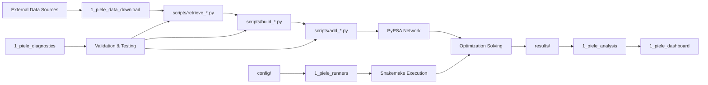
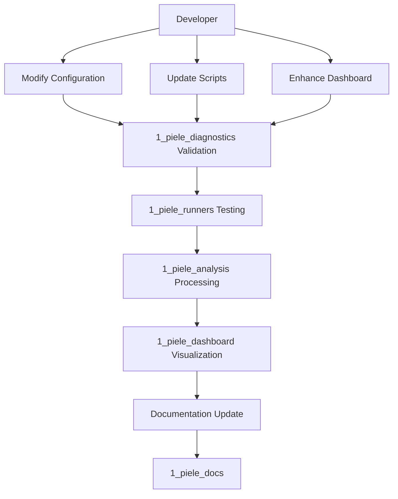

# Project Structure Map

## Repository Architecture Overview

```mermaid
graph TD
    A[PyPSA-Eur Repository] --> B[Core Framework]
    A --> C[Custom Romania Extensions]
    
    B --> D[Snakemake Workflow]
    B --> E[Configuration System] 
    B --> F[Data Processing Scripts]
    B --> G[Optimization Rules]
    
    C --> H[1_piele_analysis/]
    C --> I[1_piele_dashboard/]
    C --> J[1_piele_runners/]
    C --> K[1_piele_diagnostics/]
    C --> L[1_piele_data_download/]
    C --> M[1_piele_docs/]
    
    H --> N[Configuration Generation]
    H --> O[Results Processing]
    H --> P[Adversarial Scenarios]
    
    I --> Q[Interactive Dashboards]
    I --> R[Scenario Comparison]
    I --> S[Network Visualization]
    
    J --> T[Batch Execution]
    J --> U[Seasonal Workflows]
    J --> V[Stress Testing]
    
    K --> W[Data Validation]
    K --> X[Config Testing]
    K --> Y[Workflow Integrity]
    
    L --> Z[Weather Data]
    L --> AA[External Datasets]
    
    M --> BB[Technical Documentation]
    M --> CC[User Guides]
    M --> DD[Architecture Specs]
```

## Folder Functions and Responsibilities

### Core Framework Components

| Component | Location | Purpose | Key Files |
|-----------|----------|---------|-----------|
| **Workflow Engine** | `Snakefile`, `rules/` | Orchestrates data processing pipeline | `Snakefile`, `rules/*.smk` |
| **Configuration** | `config/` | Scenario definitions and parameters | `config.default.yaml`, `romania*.yaml` |
| **Data Scripts** | `scripts/` | Data processing and network building | `build_*.py`, `add_*.py`, `retrieve_*.py` |
| **Results** | `results/`, `resources/` | Workflow outputs and intermediate files | Generated during execution |

### Custom Romania Extensions

#### 📈 Analysis Module (`1_piele_analysis/`)
**Purpose**: Results processing, scenario generation, and reporting

| Component | Description | Key Functions |
|-----------|-------------|---------------|
| Configuration Generation | Creates scenario YAML files | `generate_configs.py`, `generate_adversarial_configs.py` |
| Results Interpretation | Analyzes optimization outputs | `interpret_results.py`, `summarize_results.py` |
| Scenario Management | Discovers and manages scenarios | `explore_scenarios.py` |
| Batch Processing | Automated analysis workflows | `run_summary.py` |

#### 📊 Dashboard Module (`1_piele_dashboard/`)
**Purpose**: Interactive visualization and scenario comparison

| Component | Description | Key Functions |
|-----------|-------------|---------------|
| Main Dashboard | Streamlit-based visualization | `visualize_scenarios_ui.py` (v1), `visualize_scenarios_ui_v2.py` (v2) |
| Scenario Manager | Advanced scenario handling | `scenario_manager/` directory |
| Data Validation | Legacy data testing | `test_legacy_display.py` |
| Documentation | User guides and technical specs | `documentation.md`, `README.md` |

#### 🚀 Runners Module (`1_piele_runners/`)
**Purpose**: Automated scenario execution and batch processing

| Component | Description | Key Functions |
|-----------|-------------|---------------|
| Seasonal Execution | Run all 5 seasonal scenarios | `run_all_scenarios.py`, `run_remaining_scenarios.py` |
| Stress Testing | Execute baseline + stress scenarios | `run_romania_winter_stress.py` |
| Windows Automation | Batch execution scripts | `*.bat` files |
| Direct Execution | Alternative execution paths | `run_romania_winter_stress_direct.py` |

#### 🔍 Diagnostics Module (`1_piele_diagnostics/`)
**Purpose**: Testing, validation, and troubleshooting

| Component | Description | Key Functions |
|-----------|-------------|---------------|
| Data Validation | Check CSV data integrity | `check_csv.py` |
| Configuration Testing | Validate scenario configs | `check_romania.py` |
| Connectivity Testing | Test external data sources | `check_url.py` |
| Workflow Testing | Verify Snakemake DAG | `test_snakemake.ps1` |

#### 📥 Data Download Module (`1_piele_data_download/`)
**Purpose**: External data acquisition and management

| Component | Description | Key Functions |
|-----------|-------------|---------------|
| Weather Data | Download climate/weather datasets | `download_cutout.py` |
| Research Datasets | Download from Zenodo repositories | `download_zenodo_files.py` |

#### 📚 Documentation Module (`1_piele_docs/`)
**Purpose**: Comprehensive project documentation

| Component | Description | Content |
|-----------|-------------|---------|
| User Guides | Step-by-step instructions | `README.md`, `README2.md`, `README3.md` |
| Technical Specs | Architecture and implementation | `TEMPLATE_ARCHITECTURE.md`, `DASHBOARD_V2_IMPLEMENTATION.md` |
| Feature Comparisons | Tool and version comparisons | `VISUALIZER_COMPARISON.md` |
| Format Support | File format compatibility | `FORMAT_SUPPORT.md` |
| Project Planning | Original planning and evolution | `PLAN.md`, `planui.md` |

## Data Flow Architecture

## Integration Points

### Configuration System
- **Base Config**: `config/config.default.yaml` - Framework defaults
- **Romania Configs**: `config/romania*.yaml` - Seasonal scenarios
- **Adversarial Configs**: `config/adversarial/` - Stress test scenarios
- **Generated Configs**: Created by `1_piele_analysis/generate_*.py`

### Execution Pathways
1. **Manual Execution**: Direct `snakemake` commands
2. **Batch Execution**: Via `1_piele_runners/` scripts
3. **Interactive Execution**: Through `1_piele_dashboard/` interfaces

### Data Dependencies
- **Weather Data**: ERA5 climate data via Atlite
- **Network Data**: ENTSO-E transmission grid
- **Economic Data**: Technology costs, fuel prices
- **Demand Data**: Country-level electricity consumption

### Results Pipeline
1. **Raw Results**: `results/` directory with PyPSA network files
2. **Processed Results**: Via `1_piele_analysis/` interpretation scripts
3. **Visualized Results**: Through `1_piele_dashboard/` interfaces
4. **Exported Results**: Summaries and reports for external use

## Development Workflow Integration

This structure enables:
- **Modular Development**: Each component can be developed independently
- **Parallel Workflows**: Multiple scenarios can run simultaneously
- **Quality Assurance**: Built-in testing and validation at each stage
- **User-Friendly Access**: Multiple interfaces for different user needs
- **Comprehensive Documentation**: All aspects covered in `1_piele_docs/`